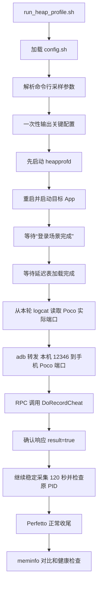

# run_heap_profile 配置输出与登录后 GM 方案

## 背景与现状

当前 `run_heap_profile.sh` 只是 `run_heap_profile.py` 的包装入口，但入口没有主动加载
`config.sh`。因此 `run_heap_profile.py` 中的 `MMAP_PHYS_APP` 依赖调用者预先导出，和
“目标 App 统一由 `config.sh` 配置”的预期不完全一致。

当前默认采样参数为：

```text
sampling_interval_bytes = 1024
shmem_size_bytes = 8388608
Perfetto trace buffer    = 63488 KiB
```

2026-08-11 20:05:22 的真实采集数据确认这轮参数确实为 `1024 / 8388608`，结果为：

```text
应用启动到“登录场景完成” = 113.485 秒
malloc_live_bytes         = 998271735
meminfo Heap Alloc        = 1113177088
diff_bytes                = 114905353（约 109.6 MiB）
health_sum                = 0
```

`health_sum=0` 表明本轮没有发现 Perfetto/heapprofd 缓冲区丢包。Perfetto 源码说明，
增大采样间隔可以降低客户端采样压力，但会增加统计误差，因此需要同时以业务启动耗时、
`diff_bytes` 和健康状态选取折中值，不能只追求更快或只追求更小差值。

Poco 代码还表明 RPC 服务会依次尝试手机端 `5001` 至 `5005`。最近一次实际监听的是
`5002`，所以不能固定把本机 `12346` 转发到手机 `5001`。

## 目标流程



## 方案

### 1. 统一配置来源

- `run_heap_profile.sh` 在选择 Python 和启动主脚本前加载同目录的 `config.sh`。
- 目标包名读取 `MMAP_PHYS_APP`；Activity 仍按
  `<MMAP_PHYS_APP>/com.dhplugin.unity.MainActivity` 生成。
- Python 主脚本启动时检查目标包名非空；缺失时输出明确错误并退出，避免形成
  `None/com.dhplugin.unity.MainActivity` 之类的无效命令。
- 文档不再写死 `com.fs.t.prf`，改为“以 `config.sh` 的 `MMAP_PHYS_APP` 为准”，
  示例使用当前配置值。

### 2. 启动时输出关键配置

在任何真机副作用之前输出一组可检索的结构化日志，至少包含：

```text
HEAP_PROFILE_CONFIG|app=...|activity=...|serial=...|interval_bytes=...|shmem_size_bytes=...|trace_buffer_kib=63488|login_stable_s=120|rpc_local_port=12346|gm=...
```

同时输出 Perfetto 根目录、trace processor、traceconv 和符号目录，便于快速确认本轮
到底使用了哪套工具和符号。采集结果目录中再保存同样的配置快照，使离线数据可以追溯。

### 3. 登录后通过 RPC 调用 GM

登录日志出现后执行以下动作：

1. 等待本轮 `logcat.txt` 出现 `RegistForGameStart.LoadOtherTable.End`，确认延迟表加载完成。
2. 从本轮已经清空并重新采集的 `logcat.txt` 中解析
   `Tcp server started and listening at <端口>`，只接受 `5001..5005`。
3. 执行 `adb forward tcp:12346 tcp:<实际端口>`；执行前移除本机 `12346` 的旧转发，
   防止上一轮残留指向错误端口。
4. 连接 `127.0.0.1:12346`，按 Poco `SimpleProtocolFilter` 协议发送：
   4 字节小端长度头 + UTF-8 JSON。
5. JSON-RPC 请求为：

```json
{
  "jsonrpc": "2.0",
  "method": "DoRecordCheat",
  "params": ["CheatFunc_BatchCheatOption.战斗录像:@40011@@|"],
  "id": 1
}
```

6. 完整读取 4 字节小端响应长度和 JSON 正文；只有响应 `result=true` 且没有
   `error` 才记为成功。
7. 输出 `HEAP_PROFILE_GM_RPC=PASS/FAIL`，并把请求方法、实际手机端口、响应或错误
   写入本轮结果目录。日志保留关键阶段，但不重复打印整段二进制数据。
8. RPC 成功后再开始 120 秒稳定采集计时，每秒检查启动时记录的原 PID；App 死亡时立即正常收尾并判定本轮失败。

RPC 失败属于目标场景未触发，脚本仍请求 Perfetto 正常收尾、保存已有 trace 和错误日志，
最终返回失败，不能把这轮数据当成有效验收结果。

### 4. 三轮采样间隔调试

修改完成后在唯一允许的真机 `1C111FDF600AW5` 上连续执行三轮，不传 duration，
共享缓冲区先固定为当前 `8388608`，避免同时改变两个变量：

```text
第 1 轮：interval=2048
第 2 轮：interval=4096
第 3 轮：根据前两轮结果自适应
  - 4096 的 diff <= 64 MiB 且明显更快：试 8192，寻找更低开销上界
  - 2048 合格但 4096 不合格：试 3072，寻找两者之间的折中点
  - 2048 已不合格且差值较 1024 明显恶化：回试 1536，优先守住数据精度
```

每轮都必须满足完整流程：heapprofd 先于 App、App 重启、登录后 RPC 触发战斗录像、
稳定采集 120 秒、Perfetto 自动收尾。每轮记录：

```text
interval_bytes
shmem_size_bytes
Activity 启动到“登录场景完成”的耗时
GM RPC 结果
malloc_live_bytes
meminfo_native_heap_alloc_bytes
diff_bytes
health_sum
heap_dump_count
trace 和报告路径
```

最终只从 `health_sum=0`、`heap_dump_count>0`、GM RPC 成功的轮次中选择参数；优先选择
`diff_bytes <= 64 MiB` 的最快轮次。若三轮都未达到 64 MiB，不放宽阈值，而是保留三轮
证据并分析固定差值来源，避免把 heapprofd 未覆盖内存误判为采样间隔问题。

## 预计修改范围

```text
run_heap_profile.sh       加载 config.sh
run_heap_profile.py       配置输出、配置快照、Poco RPC、阶段顺序和错误处理
test_run_heap_profile.sh  覆盖配置传递、配置日志、RPC 编解码和失败收尾
docs/heap_profile.md      更新配置来源、日志、GM 时序、RPC 协议和调参验收说明
README.md                 同步 Native heap profile 入口摘要
```

本方案不修改 FS 客户端或 `PocoManager.cs`，只复用现有 `DoRecordCheat` RPC。

## 执行计划

- [x] 1. 核对现有测试接口，确定配置、RPC 和阶段状态的最小改动边界。
- [x] 2. 让入口加载 `config.sh`，实现参数解析、关键配置输出和结果目录配置快照。
- [x] 3. 实现 Poco 端口解析、ADB 转发、JSON-RPC 编解码和失败后正常收尾。
- [x] 4. 将登录后的默认稳定采集时间改为 120 秒，并把计时起点移到 RPC 成功之后。
- [x] 5. 补充自动测试，同步 `docs/heap_profile.md`、`README.md` 和相关项目说明。
- [x] 6. 运行 Bash 语法检查、Python 编译检查及 `test_run_heap_profile.sh`。
- [x] 7. 在 `1C111FDF600AW5` 上完成三轮真实采样，记录并比较启动耗时、RPC、差值和健康状态。

## 执行结果

登录日志后必须继续等待 `RegistForGameStart.LoadOtherTable.End`。最初在该日志前调用 GM 的三轮均因 `MatchAiImageConfig` 未加载而进入空引用链，最终 UnityMain `SIGSEGV`；增加就绪门槛后，三轮 GM RPC 和 120 秒稳定期均完整通过。稳定期还会每秒检查启动时记录的原 PID，避免 App 重启或死亡后继续产生无效结果。

| interval | 登录耗时 | 表就绪耗时 | diff_bytes | health_sum | heap_dump_count | 输出目录 |
| ---: | ---: | ---: | ---: | ---: | ---: | --- |
| 2048 | 81.031 秒 | 24.235 秒 | 182017690 | 0 | 1 | `PerfData/mem/2026-08-11_21-12-05` |
| 4096 | 46.156 秒 | 17.563 秒 | 182706862 | 0 | 1 | `PerfData/mem/2026-08-11_21-24-05` |
| 1536 | 85.734 秒 | 28.203 秒 | 179802460 | 0 | 1 | `PerfData/mem/2026-08-11_21-28-04` |

三轮差值均高于 64 MiB，且 `1536` 到 `4096` 的差值没有随 interval 单调变化。`4096` 最快，但不能据此放宽精度门槛或替换默认值；当前保留默认 `1024`，后续单独归因约 180 MB 的固定口径差异。

`4096` 第一次尝试生成的 `PerfData/mem/2026-08-11_21-18-11` 只有约 14 KB trace、`heap_dump_count=0`。App 日志出现 heapprofd 挂钩状态竞态，确认设备侧无残留 heapprofd 后重跑得到有效 heap dump；该目录只作为故障证据，不计入调参结果。
