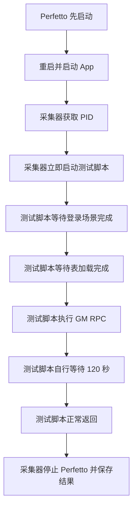
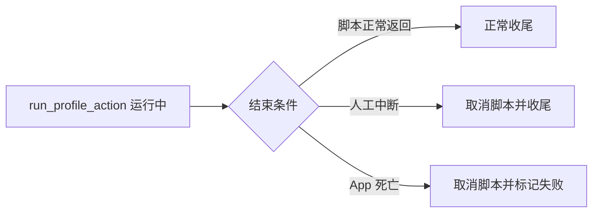

# 登录与表加载等待迁入测试脚本方案

## 背景

当前 Native heap 和 mmap 主功能采集器都在执行
`PERF_PROFILE_ACTION_SCRIPT` 之前硬编码了两个 FS 业务检查点：

1. `登录场景完成`
2. `RegistForGameStart.LoadOtherTable.End`

这使采集器仍然知道具体 App 的登录和表加载语义。更换测试脚本时，新脚本无法
自行决定前置检查点，采集器也无法用于不具备这两个日志的测试场景。

## 目标边界



迁移后的职责如下：

- 采集器负责 Perfetto、App 启动、PID、logcat、smaps、中断、App 存活检查和统一收尾。
- 测试脚本负责业务就绪条件、测试操作和操作后稳定采集时长。
- 公共 `ProfileActionSession` 继续提供按本轮 App PID 过滤的 logcat 等待和 Poco RPC，
  不把 FS 业务文本放回公共层。

## 实现方案

### 1. 独立的 FS 就绪测试步骤

新增 `profile_actions/fs_app_ready.py`，将两个通用 FS 测试步骤放在独立模块中：

```python
async def wait_login_done(session: ProfileActionSession) -> None:
  """等待本轮 FS App 进入登录界面。"""


async def wait_table_ready(session: ProfileActionSession) -> None:
  """等待本轮 FS App 完成延迟表加载。"""
```

每个函数都独立负责：

1. 输出该步骤的开始日志和超时参数。
2. 调用 `session.wait_for_app_log()` 等待自己负责的日志。
3. 检查公共 API 返回结果；失败时抛出包含步骤名和底层原因的异常。

模块不执行 GM、不决定采集时长，也不依赖具体采集器。其他测试脚本可以只复用
`wait_login_done()`，也可以按顺序复用两个步骤，不必复制日志文本、超时语义和
错误处理。

两个日志等待都使用 `include_existing=True`。这样即使 App 在 PID 获取和测试脚本
实际启动之间已经输出检查点，也不会漏掉本轮日志。公共 API 会继续严格校验
`context.pid`，不会命中其他进程或上一轮 App 的日志。

登录等待沿用 `HEAP_PROFILE_LOGIN_TIMEOUT_S`：`0` 表示不限时。表加载等待沿用
`HEAP_PROFILE_GM_READY_TIMEOUT_S`，默认 180 秒。

### 2. 默认 GM 脚本组合通用步骤

修改 `profile_actions/send_battle_record_gm.py`，导入并组合两个通用函数：

```python
async def run_profile_action(session: ProfileActionSession) -> None:
  await wait_login_done(session)
  await wait_table_ready(session)
  await invoke_battle_record_gm(session)
  await asyncio.sleep(get_stable_collection_seconds())
```

表就绪后脚本调用 `DoRecordCheat`，RPC 成功后由脚本自身异步等待 120 秒，
然后正常返回。稳定采集时长继续沿用 `HEAP_PROFILE_LOGIN_STABLE_S`，默认 120 秒。

### 3. 删除公共等待时间功能

当前公共执行器要求每个测试模块提供
`get_collection_wait_seconds(session)`，并从 `run_profile_action()` 刚启动时开始倒计时。
这会把测试脚本内部不同阶段压成一个公共总时长，无法表达“GM 成功后再等待
120 秒”这种真实语义。

本次直接删除该功能：

- 测试模块不再实现 `get_collection_wait_seconds()`。
- 动态加载器只校验异步 `run_profile_action(session)`，不再校验等待时间函数。
- 公共执行器删除等待时间读取、数值校验、倒计时截止和
  `PROFILE_ACTION_WAIT|seconds=...` 输出。
- 测试脚本在需要的准确位置自行调用 `asyncio.sleep()` 或其他可取消等待。
- `run_profile_action()` 正常返回表示测试完成，采集器随后收尾。

公共执行器仅保留三类竞速条件：



默认 GM 脚本只在 RPC 成功后执行可取消的 120 秒异步等待。
人工中断或 App 死亡仍由公共执行器立即取消脚本，不会失去现有保护。

### 4. 采集器去除 FS 业务检查点

修改 `run_heap_profile.py` 和 `collect_mmap_phys_data.py`：

- 获取目标 PID 并建立必要的采集会话后，立即构造 `ProfileActionContext` 并执行
  配置的测试脚本。
- 删除采集器中的登录、表加载文本常量和两套重复等待函数。
- 删除只有采集器硬编码阶段才能产生的
  `APP_LOGIN_SECONDS` 和 `GM_READY_SECONDS_AFTER_LOGIN` 输出；用通用
  `PROFILE_ACTION_APP_LOG=PASS/FAIL` 和脚本阶段日志作为真实执行依据。
- 保留配置快照中对测试脚本路径的记录，但 FS 特有的超时参数由脚本输出，
  不再伪装成采集器配置。

`run_mmap_phys_profile.sh --no-mmap-callstacks` 的无栈验证不执行测试脚本，
仍保持“Perfetto 先于 App 启动 + 固定 45 秒 + mmap syscall events/smaps 健康检查”，
本次不改变该流程。

## 错误与输出

默认测试脚本对关键阶段输出结构化日志：

```text
PROFILE_ACTION_STAGE=WAIT_LOGIN|timeout_s=none
PROFILE_ACTION_STAGE=WAIT_TABLE|timeout_s=180
PROFILE_ACTION_STAGE=INVOKE_GM
PROFILE_ACTION_STAGE=STABLE_COLLECTION|seconds=120
```

日志等待和 RPC 的底层结果继续由公共 API 输出
`PROFILE_ACTION_APP_LOG=PASS/FAIL` 和 `PROFILE_ACTION_RPC=PASS/FAIL`。
测试脚本对失败结果补充业务阶段后抛出异常，最终由公共执行器输出
`PROFILE_ACTION=FAIL|reason=action_failed|error=...`。

## 测试与验收

实现后执行以下验证：

1. 新增 `profile_actions/tests/test_fs_app_ready.py`，独立覆盖登录与表加载步骤的
   日志内容、PID 过滤、超时参数、历史日志命中和失败输出。
2. 扩展 `profile_actions/tests/test_send_battle_record_gm.py`，覆盖两个通用步骤的
   组合顺序、GM 顺序、GM 成功后才开始稳定等待，以及不再实现
   `get_collection_wait_seconds()`。
3. 调整 `test_run_heap_profile.sh` 和 `test_collect_mmap_profile_control.py`，
   验证采集器获取 PID 后直接执行测试脚本，不再匹配 FS 业务日志。
4. 调整 `device_test_framework/tests/test_actions_runner.py`，覆盖新的单函数模块契约、
   脚本正常完成、异常、中断、App 死亡和取消清理，删除倒计时相关用例。
5. 运行 profile action、公共执行器、Native heap 采集控制和 mmap 主功能控制的相关单测。
6. 同步更新 `README.md`、`docs/heap_profile.md`、`docs/mmap_phys_analyzer.md`、
   `docs/内存观测.md` 和 `profile_actions/README.md`，使职责边界和参数语义与代码一致。
7. 因本次同时修改 Native heap 和 mmap 主功能的调用栈采集控制流程，
   按项目规则使用主功能真机验收，不以无栈 mmap 验证替代。真机仅使用
   `1C111FDF600AW5`，不使用 `adb monkey`；如需目标场景操作，由用户在手机上手动操作。

## 预计改动文件

```text
profile_actions/send_battle_record_gm.py
profile_actions/fs_app_ready.py
profile_actions/tests/test_send_battle_record_gm.py
profile_actions/tests/test_fs_app_ready.py
device_test_framework/actions/runner.py
device_test_framework/tests/test_actions_runner.py
device_test.ini
run_heap_profile.py
test_run_heap_profile.sh
collect_mmap_phys_data.py
test_collect_mmap_profile_control.py
README.md
docs/heap_profile.md
docs/mmap_phys_analyzer.md
docs/内存观测.md
profile_actions/README.md
```

## 执行计划

- [x] 1. 梳理并固定新的单函数测试脚本契约。
- [x] 2. 删除公共等待时长功能，新增可复用的 FS 登录与表加载步骤。
- [x] 3. 调整 Native heap 与 mmap 主采集控制流程。
- [x] 4. 更新并运行相关自动化测试。
- [x] 5. 同步使用文档，完成主功能真机验收并记录结果。

## 执行与验收结果

### 自动化测试

```text
device_test_framework/tests: 32 项通过
profile_actions/tests: 8 项通过
test_collect_mmap_profile_control.py: 3 项通过
test_run_heap_profile.sh: 通过
test_run_mmap_phys_profile.sh: 通过
Python 编译检查和 Bash 语法检查: 通过
```

### Native heap 真机主流程

设备：`1C111FDF600AW5`。输出目录：
`PerfData/mem/2026-08-14_16-33-34`。

```text
PROFILE_ACTION_APP_LOG=PASS|pattern=登录场景完成
PROFILE_ACTION_APP_LOG=PASS|pattern=RegistForGameStart.LoadOtherTable.End
PROFILE_ACTION_RPC=PASS|method=DoRecordCheat
PROFILE_ACTION_STAGE=STABLE_COLLECTION|seconds=120
PROFILE_ACTION=PASS|reason=action_completed
```

首轮默认 10 秒 RPC 超时在 Native heap 高负载下未收到响应。logcat 显示 App 已接收
128 字节请求，但主线程仍在 `RegistForGameStart.BuildCache.*` 阶段。将项目默认
RPC 超时调整为 30 秒后，GM 和其后 120 秒稳定采集完整通过。

本轮最终命令返回失败是既有 malloc live 与 meminfo 口径差异：
`diff_bytes=193392576`，超过 64 MiB 阈值；`health_sum=0`、`heap_dump_count=1`。
该差异与本次测试脚本控制流迁移无关，本次不改动 malloc/meminfo 验证口径。

### mmap 调用栈真机主功能

设备：`1C111FDF600AW5`。最终通过目录：
`PerfData/mmap_phys/2026-08-14_16-46-21`。

```text
PROFILE_ACTION=PASS|reason=action_completed
DEVICE_TEST=PASS|feature=mmap|flow=fs_login_battle
Perfetto trace buffer: data_loss=0
ftrace kernel buffer: data_loss=0
linux.perf callstack buffer: data_loss=0
traced_perf profiler: data_loss=0
perf samples/callsites: 12070/12070
mmap syscall events: 34328
smaps snapshots: 91
memory validation: pass
```

前一轮 `2026-08-14_16-41-45` 在相同 `32768 pages/25ms` 配置下出现
`perf_cpu_lost_records=536`。根据 Perfetto 源码口径和项目已有真机记录，这是内核
perf ring buffer 启动峰值的瞬时 overrun；当前每 CPU 已使用约 128 MiB，没有继续
盲目翻倍。同配置重跑后所有丢失项归零，主功能验收通过。
