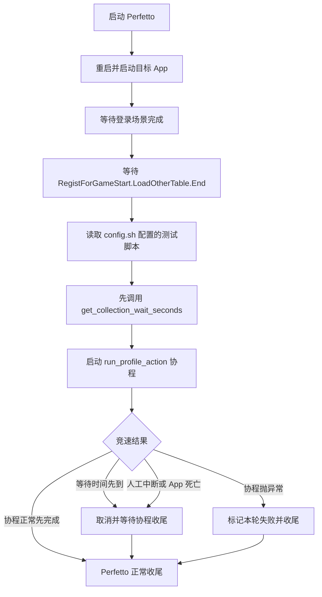

# 表加载后按配置执行测试脚本方案

## 背景

`run_heap_profile.py` 目前在登录和表加载完成后，内置 Poco RPC 协议并固定发送
`CheatFunc_BatchCheatOption.战斗录像:@40011@@|`。这把“采集生命周期”和“本次测试如何
操作游戏”绑定在一起，更换测试目的需要修改采集器。

`run_mmap_phys_profile.sh` 的主功能尚未建立“登录完成 -> 表加载完成 -> 执行测试
操作 -> 稳定采集”阶段。

## 目标流程



## 配置契约

`config.sh` 增加：

```bash
# 表加载完成后执行的测试操作脚本。相对路径以 00wann 为基准。
export PERF_PROFILE_ACTION_SCRIPT=profile_actions/send_battle_record_gm.py

```

配置文件必须是 Python 模块。采集器通过文件路径动态加载，不要求模块位于
`PYTHONPATH`。每个测试模块必须提供两个函数：

```python
async def run_profile_action(context: ProfileActionContext) -> None:
  """表加载完成后执行测试操作；协程结束时结束采集。"""


def get_collection_wait_seconds(
    context: ProfileActionContext,
) -> float | None:
  """返回本轮最长采集秒数；None 表示不设置超时。"""
```

### 调用顺序

1. 表加载完成后，先同步调用 `get_collection_wait_seconds(context)`。
2. 校验返回值后，启动 `run_profile_action(context)` 协程任务。
3. 采集器同时等待协程、超时、人工中断和目标 App 存活状态。
4. 超时或外部停止先发生时，取消协程并等待其 `finally` 清理完成，再停止 Perfetto。

`get_collection_wait_seconds()` 必须显式返回：

- `0` 或正数：从 `run_profile_action()` 协程启动时开始计时，超时或协程完成
  任一先发生都结束采集。
- `None`：不创建超时任务；协程完成、人工中断或目标 App 死亡任一发生时
  结束采集。

返回负数、非数字或非有限数值都是脚本契约错误，本轮正常收尾 trace 后
返回失败。`get_collection_wait_seconds()` 只返回等待时间，不在函数内阻塞；
竞速、中断、协程取消和 PID 存活检查由采集器统一管理。

### 结束语义

- 等待时间先到：这是模块声明的正常结束条件，本轮不因“超时”判失败。
- 协程正常先完成：正常结束采集。
- 协程抛异常：正常收尾 trace，但本轮返回失败。
- 协程被取消：模块必须在 `finally` 中清理 ADB 转发、子进程等资源；清理完成后
  采集器才停止 Perfetto。

采集器通过只读 `ProfileActionContext` 向脚本传递本轮上下文：

```text
app             目标包名
pid             本轮目标 PID
output_dir      本轮输出目录绝对路径
logcat_path     本轮 logcat 路径
adb             adb 可执行文件
rpc_local_port  Poco RPC 本机端口，默认 12346
android_serial  目标设备
```

测试模块的输出同时打印到控制台并保存为本轮 `profile_action.log`。
`run_profile_action()` 协程正常返回表示测试操作已完成；抛异常表示本轮失败。
采集器仍正常停止 Perfetto 并保存已有 trace，最终返回失败。

## 默认 GM 脚本

将现有内置 Poco 逻辑移到：

```text
profile_actions/send_battle_record_gm.py
```

该脚本独立完成：

1. 从本轮 `logcat` 中读取目标 PID 对应的 Poco `5001..5005` 实际监听端口。
2. 建立 `adb forward tcp:12346 tcp:<实际端口>`。
3. 调用 `DoRecordCheat`，参数保持当前战斗录像 GM。
4. 完整校验 JSON-RPC 响应并清理 ADB 转发。
5. `get_collection_wait_seconds()` 返回 `120`。
6. 由于当前没有“战斗录像完成”信号，默认 GM 协程在 RPC 成功后保持挂起，
   由 120 秒等待时间触发取消和收尾，保持现有采集时长。

后续测试模块如果能准确判断场景完成，`run_profile_action()` 可以自行正常返回，
从而在最长等待时间到期前提前结束采集。

## 通用 App logcat 检查 API

新增测试模块稳定 API `profile_action_api.py`，测试模块可直接导入：

```python
from profile_action_api import AppLogMatch, wait_for_app_log
```

函数契约：

```python
async def wait_for_app_log(
    context: ProfileActionContext,
    pattern: str | re.Pattern[str],
    *,
    timeout_seconds: float | None = None,
    include_existing: bool = False,
    poll_interval_seconds: float = 0.2,
) -> AppLogMatch:
  """
  等待本轮目标 App PID 的 logcat 命中字面量或正则。
  默认只检查函数调用后新追加的日志。
  """
```

### 匹配语义

- `pattern` 为 `str` 时做字面子串匹配，不隐式当作正则。
- `pattern` 为已编译 `re.Pattern` 时做正则搜索。
- 只接受 `logcat -v time` 中 PID 等于 `context.pid` 的行，避免其他进程同文本误命中。
- `include_existing=False` 时从调用时的文件末尾开始；为 `True` 时从本轮
  `logcat.txt` 开头检查。
- 文件追加数据按增量读取，保留未换行尾部，能处理一行被两次读取拆开。
- logcat 文件被截断或重建时，偏移量安全重置到文件开头。

### 等待与取消

- `timeout_seconds=None` 表示该次日志等待不单独设超时，仍受测试模块总等待时间
  和外部取消控制。
- 指定超时后未命中时抛出 `AppLogTimeoutError`，异常包含 pattern、PID、timeout
  和 logcat 路径。
- 协程取消时直接传播 `asyncio.CancelledError`，不吞掉取消。
- `poll_interval_seconds` 必须大于 0，避免忙轮询。

`AppLogMatch` 至少包含：

```text
line          命中的完整 logcat 行
matched_text  字面量或正则实际命中文本
pid           目标 PID
```

测试模块示例：

```python
async def run_profile_action(context: ProfileActionContext) -> None:
  await send_gm(context)
  await wait_for_app_log(
      context,
      "战斗录像播放完成",
      timeout_seconds=90,
  )


def get_collection_wait_seconds(context: ProfileActionContext) -> float | None:
  return 120
```

上例中，完成日志先出现则协程先结束；120 秒先到则采集器取消协程并
正常收尾。

这保持默认行为不变，之后更换测试目的只需在 `config.sh` 更换脚本路径。

## 共用实现

新增一个公共 Python 模块，由 heap 和 mmap 采集器共用，避免两套脚本执行语义
漂移。该模块负责：

- 解析并校验配置模块路径。
- 动态加载并校验两个必需函数。
- 构造只读 `ProfileActionContext`。
- 启动并监控协程，执行协程/超时/中断/App 死亡的竞速。
- 超时或外部停止时取消协程并等待清理完成。
- 记录日志和结构化 PASS/FAIL/结束原因输出。

`run_heap_profile.py` 保留登录、表就绪和 PID 存活管理，将
`invoke_login_gm()` 替换为公共脚本执行器。

`collect_mmap_phys_data.py` 的主调用栈采集补齐：

```text
Perfetto 先启动 -> App 重启 -> logcat -> 登录 -> 表就绪
-> 先取等待时间 -> 启动协程并竞速 -> 正常收尾
```

mmap 主功能的 smaps 从 App 启动后持续采集，覆盖登录、脚本操作和脚本指定的等待期；
Perfetto 不再使用可能在登录前就到期的固定 duration 作为主收尾信号，改为主机阶段
控制完成后发送 `SIGINT`。

## 无栈 mmap 边界

`run_mmap_phys_profile.sh --no-mmap-callstacks` 保持现有独立验证语义：

- Perfetto 先于 App 启动。
- 重启目标 App。
- 固定采集 45 秒。
- 只检查 mmap syscall events、smaps 和 buffer 健康。
- 不执行配置测试脚本，不改变该验证的目标和时长。

## 错误处理

```text
配置缺失/脚本不存在  -> 真机操作前失败
登录或表就绪超时      -> 正常收尾 trace，本轮失败
协程抛异常              -> 正常收尾 trace，本轮失败
等待时间先到          -> 取消协程后正常收尾，本轮成功
结束函数返回非法值      -> 正常收尾 trace，本轮失败
App 中途死亡             -> 立即正常收尾，本轮失败
人工中断                  -> 转发停止信号并等待 trace 落盘
```

## 预计修改范围

```text
config.sh                              配置测试模块
profile_action_api.py                  稳定 Context、logcat 等待 API 和异常类型
profile_action_runner.py               公共模块加载、协程竞速和取消契约
profile_actions/send_battle_record_gm.py  现有 GM RPC 的默认脚本
run_heap_profile.py                    将内置 GM 替换为配置脚本
collect_mmap_phys_data.py              mmap 主功能补齐阶段控制
test_run_heap_profile.sh               覆盖协程完成/异常/超时/取消
test_run_mmap_phys_profile.sh          覆盖主功能阶段和无栈边界
docs/heap_profile.md                   更新配置和时序
docs/mmap_phys_analyzer.md             更新主功能和无栈边界
README.md                              同步两个入口摘要
```

## 执行计划

- [x] 1. 实现公共 Context/logcat API、协程执行器和默认 GM 脚本。
- [x] 2. 将 Native heap 流程切换为表就绪后执行配置脚本。
- [x] 3. 为 mmap 主功能补齐 App 重启、logcat、登录、表就绪、脚本和持续 smaps。
- [x] 4. 保持 45 秒无栈 mmap 验证不执行配置脚本。
- [x] 5. 补充自动测试和文档，运行语法、单测及真机验证。

真机验证结论：登录、表加载、默认 GM RPC、120 秒等待竞速、smaps 持续采集和
Perfetto 主动收尾均通过。目标进程虽有 21154 个 perf samples，但
`perf_callsites=0`；设备日志确认 `traced_perf` 读取 `/proc/<pid>/maps` 返回
`Permission denied`。工具已将该情况明确判为 `perf_callstacks_missing` 失败，需修复
设备 producer 权限后重新验收调用栈归因，不能把当前空归因结果视为主功能通过。
