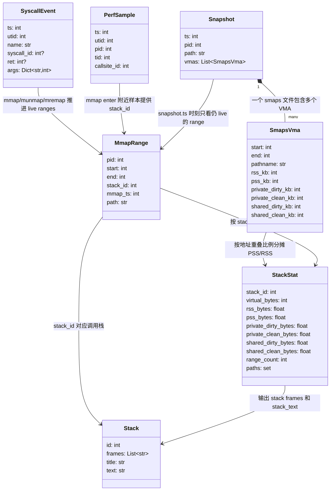

# mmap 真实物理内存归因 README

本工具用于回答一个问题：

```text
哪个 mmap 调用栈，最终占用了多少真实物理内存？
```

它不是只统计 mmap 的虚拟地址大小，而是把 Perfetto 中采到的 mmap 调用栈、mmap/munmap/mremap 生命周期，以及 `/proc/<pid>/smaps` 中的 PSS/RSS 快照做地址重叠归因，最终输出 Perfetto UI 可加载的 JSON 和 go tool pprof 可加载的数据。

默认入口同时采集 `mmap` 调用栈和 `libc.malloc` Native heap profile。本文把两个用途明确分开：

```text
主功能
  -> 采 mmap 调用栈，输出 mmap 物理内存归因 JSON 和 pprof 数据。

验证模式
  -> 不采 mmap 调用栈，只做无栈 mmap 事件健康检查。
```

无栈验证是测试功能，用来检查 mmap syscall 事件、smaps 和 meminfo 快照是否能被稳定采集，不能替代调用栈归因结果。无栈验证不启用 heapprofd malloc，也不做 malloc live 与 Native Heap Alloc 对比。

## 核心思路

```text
Perfetto raw_syscalls/sys_enter + sys_exit
  -> 还原 mmap / munmap / mremap 生命周期

Perfetto linux.process_stats + sched_switch
  -> 补齐 pid / thread 归属，避免无栈验证按目标进程过滤时误判为空

Perfetto linux.perf
  -> 在 mmap syscall enter 附近采样调用栈

/proc/<pid>/smaps
  -> 提供每个 VMA 当前真实物理占用：PSS / RSS / PrivateDirty

离线分析器
  -> 用 live mmap range 与 smaps VMA 做地址重叠
  -> 按调用栈聚合 PSS / RSS / virtual bytes
  -> 同一个 VMA 的 PSS/RSS 只归因一次；多个 mmap 命中同一 VMA 时按重叠权重分摊
```

优先看 `pss_bytes`。`rss_bytes` 对共享页会重复计数，适合作为辅助参考。

## 文件说明

```text
run_mmap_phys_profile.sh
  -> 默认入口脚本，使用写死默认配置启动采集和分析。

run_mmap_phys_analyze_latest.sh
  -> 离线分析包装脚本：默认使用最近一次 mmap 采集目录，补齐 fs.ini 分类和常用输出路径。

collect_mmap_phys_data.py
  -> 采集脚本：启动 Perfetto，周期拉 smaps，调用离线分析器，并生成内存总量验证报告。

mmap_phys_analyzer.py
  -> 离线分析器：读取 trace + smaps，输出归因 JSON。

test_mmap_phys_analyzer.py
  -> 单元测试，覆盖 mmap / munmap / smaps 归因、raw syscall 参数兼容、输出格式。
```

## 主功能：mmap 调用栈归因

主功能用于回答“哪个 mmap 调用栈最终占用了多少真实物理内存”。这是 `run_mmap_phys_profile.sh` 的默认行为，不需要额外参数：

```bash
./run_mmap_phys_profile.sh
```

默认入口会给离线分析器追加：

```bash
--classify-config heap_analyzer/fs.ini --top-n 0
```

因此默认结果会启用 `fs.ini` 分类，并让普通 Perfetto JSON / 默认 pprof 也保留全部
mmap 调用栈。显式传入新的 `--classify-config` 或 `--top-n` 时，用户参数会排在默认值
之后生效，只改变本次运行的输出口径。

默认目标进程来自 `MMAP_PHYS_APP`。当前 `config.sh` 默认值为：

```text
com.fs.t.prf
```

命令行前缀里的 `MMAP_PHYS_APP=...` 会覆盖 `config.sh` 默认值；如果没有任何配置，
脚本内部回退到 `com.tencent.dhwdxkty.trunk.profiler`。

`run_mmap_phys_profile.sh` 只会在目标包是 `com.fs.t.prf` 或
`com.tencent.dhwdxkty.trunk.profiler` 时向应用外部目录推送 FS 专用
`debugconfig.txt`；demo/其他包会跳过该步骤，避免 Android/data 权限阻塞无栈验证。

默认 trace processor：

```text
Linux 优先：
  $PerfettoRoot/out/linux_clang_release/trace_processor_shell

Windows Git Bash 优先：
  $PerfettoRoot/out/win_clang/trace_processor_shell.exe
  $PerfettoRoot/out/win/trace_processor_shell.exe
```

入口脚本会通过 `common_tools.sh` 自动选择 Python、`trace_processor_shell` 和
`traceconv`。如需覆盖，可显式设置：

```bash
PYTHON=python TRACE_PROCESSOR=/path/to/trace_processor_shell TRACECONV=/path/to/traceconv ./run_mmap_phys_profile.sh
```

如果需要脚本在目标进程不存在时自动拉起指定 Activity，可设置
`MMAP_PHYS_ACTIVITY=<package>/<activity>`。未设置时保留旧行为，只发送一次
launcher Intent。

运行前需要目标 App 已启动；脚本会等待目标进程出现。采集过程中可以触发 App 行为，例如：

```text
在手机上手动进入目标场景并执行需要观测的操作。
```

主功能采集和分析内容：

```text
linux.ftrace raw_syscalls
  -> 采 mmap / munmap / mremap 参数和返回值，用于还原 mmap 生命周期。

linux.perf callstack_sampling
  -> 在 mmap syscall enter 附近采目标进程调用栈。

/proc/<pid>/smaps
  -> 周期拉取 PSS / RSS / PrivateDirty 快照。

mmap_phys_analyzer.py
  -> 把 mmap live range 与 smaps VMA 做地址重叠，按 mmap 调用栈聚合 PSS / RSS / virtual bytes。
```

主功能输出：

```text
mmap_phys_attribution.json
  -> Perfetto UI 可加载的 mmap 调用栈物理内存归因结果。

mmap_phys_attribution.pprof.pb.gz
  -> go tool pprof 可加载的 mmap PSS/RSS/virtual 调用栈数据。

mmap_classification_summary.xlsx
  -> 默认 fs.ini 分类生成的 PSS/RSS/virtual 汇总表。

mmap_classification_summary.pprof.pb.gz
  -> 默认 fs.ini 分类生成的分类汇总 pprof 数据。

pprof_categories/*.pprof.pb.gz
  -> 默认 fs.ini 分类生成的每分类 mmap 调用栈 pprof 数据。

memory_validation.json
  -> 随采集生成的验证报告；只作为量级校验，不是主功能结果。
```

主功能必须优先看 `mmap_phys_attribution.json` 和 pprof 数据。`memory_validation.json` 不能替代调用栈归因。

## 验证模式：无栈 mmap 事件健康校验

验证模式用于测试或改代码后的量级校验。它故意关闭 mmap 调用栈采样，但会保留 `raw_syscalls/sys_enter`、`raw_syscalls/sys_exit` 和线程归属所需事件作为兼容兜底；部分设备的 `syscall_events` 过滤不会产出事件，只依赖它会让 mmap 侧验证结果恒为 0。

```bash
./run_mmap_phys_profile.sh --no-mmap-callstacks
```

该模式不采 `android.heapprofd`。malloc 总量验证已经从无栈验证中删除；需要验证 Perfetto malloc 统计能力时，使用独立 heapprofd malloc APK demo。
运行无栈验证时脚本会先 `am force-stop` 目标 App，再启动 Perfetto，最后拉起目标 App，确保启动期 mmap syscall 不会在 Perfetto 就绪前漏掉。

验证模式采集和汇总内容：

```text
sys_mmap / sys_munmap / sys_mremap
  -> 不读取 mmap 调用栈，只还原无栈 mmap 生命周期。

最后一个 smaps 快照
  -> 与无栈 mmap live range 做地址重叠，汇总 mmap PSS / RSS / virtual bytes。

dumpsys meminfo
  -> 解析 Native Heap PSS / Native Heap Alloc / TOTAL PSS；报告保留 meminfo 作为快照参考，但不再做 malloc 对比。
```

验证模式输出：

```text
PerfData/mmap_phys/<时间戳>/
  -> 单轮无栈验证目录；通过或失败都会保留原始输入和报告。

memory_validation.json
  -> mmap 事件健康状态、mmap PSS 汇总和 meminfo 快照参考。

mmap_health_report.md
  -> 采集结束后写出的 Markdown 健康报告；同样会打印到终端。
  -> 优先用表格展示 Perfetto/ftrace/perf 丢数说明、mmap syscall/smaps
     健康状态、最后一份 smaps 与 dumpsys meminfo 主表的分类对齐。

mmap_health_report.json
  -> 与 Markdown 健康报告同源的机器可读 JSON。

dumpsys_meminfo.txt
  -> adb shell dumpsys meminfo <package> 原始输出。

mmap_trace.perfetto-trace 和 smaps/
  -> 验证报告的原始输入。
```

验证模式不会生成新的 `mmap_phys_attribution.json`、`mmap_phys_attribution.pprof.pb.gz` 或 `mmap_phys_attribution.speedscope.json`，因为当前运行没有采集 mmap 调用栈。它适合回答“无栈 mmap 事件是否能采到、smaps 是否能汇总”，不适合回答“哪个调用栈占了物理内存”，也不再回答“malloc live 是否接近 Native Heap Alloc”。

## 常用参数

```bash
./run_mmap_phys_profile.sh \
  --duration-ms 30000 \
  --smaps-interval-ms 1000
```

参数含义：

```text
--duration-ms
  -> Perfetto 采集时长，单位 ms。
  -> 默认 75000 ms，也就是 1 分 15 秒。

--smaps-interval-ms
  -> smaps 快照间隔，单位 ms。

--use-su
  -> 强制用 su 0 读取 /proc/<pid>/smaps。

--no-analyze
  -> 只采集 trace 和 smaps，不运行离线分析器。

--mmap-callstacks
  -> 采集 mmap 调用栈并运行 mmap 物理归因分析；这是默认主功能入口。

--no-mmap-callstacks
  -> 进入验证模式：不采 mmap 调用栈，只运行 mmap 事件健康检查。

--no-ftrace
  -> 不采 raw syscall 参数；只能调试 perf 调用栈，不适合最终归因。
```

说明：默认情况下，如果普通权限读取 smaps 得到 `Permission denied` 这类无效内容，采集脚本会自动尝试 `su 0`。

## Perfetto 采集配置

采集脚本会生成 `mmap_phys_config.pbtxt`。主功能核心配置如下：

```protobuf
data_sources {
  config {
    name: "linux.ftrace"
    ftrace_config {
      syscall_events: "sys_mmap"
      syscall_events: "sys_munmap"
      syscall_events: "sys_mremap"
      syscall_events: "sys_madvise"
      ftrace_events: "raw_syscalls/sys_enter"
      ftrace_events: "raw_syscalls/sys_exit"
      ftrace_events: "sched/sched_switch"
    }
  }
}

data_sources {
  config {
    name: "linux.process_stats"
    process_stats_config {
      scan_all_processes_on_start: true
    }
  }
}

data_sources {
  config {
    name: "linux.perf"
    perf_event_config {
      timebase {
        period: 1
        tracepoint {
          name: "raw_syscalls:sys_enter"
          filter: "id == 222"
        }
      }
      callstack_sampling {
        scope {
          target_cmdline: "com.tencent.dhwdxkty.trunk.profiler"
        }
        kernel_frames: true
      }
      ring_buffer_pages: 32768
      ring_buffer_read_period_ms: 25
    }
  }
}
```

当前默认 `ring_buffer_pages: 32768`、`ring_buffer_read_period_ms: 25` 来自 FS
启动 mmap 调用栈采样实测无 `perf_cpu_lost_records` 的配置。该 buffer 是每 CPU
4 KiB 页数，主要用于吸收启动期 mmap tracepoint 的短时峰值；如果
`memory_validation.json` 中 `trace_health.perf_data_loss` 非 0，先检查
linux.perf ring buffer，不要优先增大 Perfetto 全局 `--buffer-kb`。

### traced_perf 内部 perf sample 丢失口径

`trace_health.perf_data_loss` 和 `trace_health.perf_samples_skipped_dataloss`
是两个不同层级的丢样：

```text
perf_data_loss
  -> trace_processor stats: perf_cpu_lost_records
  -> kernel per-cpu perf ring buffer overrun
  -> 处理方向：增大 ring_buffer_pages，缩短 ring_buffer_read_period_ms，或降低采样输入。

perf_samples_skipped_dataloss
  -> trace_processor stats: perf_samples_skipped_dataloss
  -> traced_perf 内部 reader 到 unwinder 队列阶段 load shedding
  -> 处理方向：降低单条样本展开成本、削平 reader 批量输入、避免固定 unwinder queue 被打满，
     或降低调用栈采样压力。
```

主功能 mmap 调用栈采样在 Perfetto 内部的大致位置如下：

```text
raw_syscalls:sys_enter id == 222
  -> kernel 产生 perf sample
  -> 写入每 CPU perf ring buffer
  -> traced_perf reader 按 ring_buffer_read_period_ms 读取 ring buffer
  -> reader 把包含 pid/tid、timestamp、cpu、用户栈/内核栈 payload 的 sample
     放入 unwinder queue
  -> Unwinder 线程取出 ParsedSample，展开为 CompletedSample(frames, build_ids)
  -> PerfProducer 把 frames/build_ids intern 成 callstack_iid，并写入 PerfSample
  -> trace_processor 把 callstack_iid 导入为 __intrinsic_perf_sample.callsite_id 和 stack_profile 表
  -> mmap_phys_analyzer.py 用 mmap enter 附近的 callsite_id 做 mmap 物理归因
```

#### unwinder queue 消费和 callsite_id 生成链路

`unwinder queue` 的写入方是 traced_perf 的 reader，也就是
`PerfProducer::ReadRingBuffers()` 读取每 CPU perf ring buffer 后，在
`ReadAndParsePerCpuBuffer()` 中把需要调用栈展开的 `ParsedSample` 写入队列。每次读完一批
kernel ring buffer，reader 会调用 `unwinding_worker_->PostProcessQueue()` 唤醒 unwinder。

`unwinder queue` 的消费方是 `Unwinder`。`Unwinder::ProcessQueue()` 运行在专用的
unwinder task runner/线程上，调用 `ConsumeAndUnwindReadySamples()` 取队列快照并遍历
未消费条目。只有目标进程的 `/proc/<pid>/maps` 和 `/proc/<pid>/mem` fd 已准备好，或者
该 sample 只需要处理 kernel callchain 时，才会调用 `UnwindSample()`。用户态展开使用
`libunwindstack` 或 frame pointer unwinder；kernel frames 由 kernel 提供的 callchain
做符号化。

队列容量不是 Perfetto 配置项，而是 traced_perf 编译期常量：

```text
src/profiling/perf/unwinding.h
  kUnwindQueueCapacity = 4096

src/profiling/perf/unwind_queue.h
  UnwindQueue<UnwindEntry, QueueSize>
  -> single-writer/single-reader 固定大小 ring buffer
  -> wr - rd >= QueueSize 时 BeginWrite() 返回 invalid
```

因此 `--perf-ring-buffer-pages` 和 `--perf-ring-buffer-read-period-ms` 控制的是
kernel perf ring buffer，不控制 unwinder queue 的 4096 个槽位。`max_enqueued_footprint_kb`
控制的是已排队 sample stack payload 的可选内存阈值，也不改变槽位数；当前脚本未设置该字段，
等价于 `0`，footprint 阈值检查关闭。

展开成功后的数据流不是直接写出 trace_processor 的 `callsite_id`：

```text
Unwinder::UnwindSample()
  input : ParsedSample(common, regs, stack, kernel_ips)
  output: CompletedSample(common, frames, build_ids, unwind_error)

PerfProducer::EmitSample()
  -> callstack_trie_.CreateCallsite(frames, build_ids)
  -> 写 InternedData(callstacks/frames/mappings/strings)
  -> 写 TracePacket.perf_sample.callstack_iid

trace_processor ProfileModule::ParsePerfSample()
  -> 读取 PerfSample.callstack_iid
  -> StackProfileSequenceState::FindOrInsertCallstack()
  -> StackProfileTracker::InternCallsite()
  -> 写 stack_profile_callsite / stack_profile_frame 等表
  -> 写 perf_sample.callsite_id

mmap_phys_analyzer.py
  -> 只读取 __intrinsic_perf_sample 中 callsite_id IS NOT NULL 的行
  -> 按 utid 和时间窗口匹配 mmap enter 附近最近的 sample
```

所以 `perf_samples_skipped_dataloss` 影响 mmap 归因的具体方式是：这些 sample 在
reader 到 unwinder 入队阶段已经被跳过，没有进入 `UnwindSample()`，不会产生
`CompletedSample`，也就没有 `callstack_iid`；trace_processor 最终无法给该 sample 生成
`callsite_id`。

`PROFILER_SKIP_UNWIND_ENQUEUE` 有两个来源：一是 traced_perf 判断 unwinder queue
中已排队样本的 footprint 超过 `max_enqueued_footprint_kb` 派生的字节阈值；二是
unwinder queue 已满，reader 申请写入槽位失败。trace_processor 导入该 marker 后
递增 `perf_samples_skipped_dataloss`。这表示 kernel ring buffer 可能已经成功被读取，
但该 sample 没有进入调用栈展开阶段，因此不会产生可供 mmap 归因使用的
`callsite_id`。

当前 `collect_mmap_phys_data.py` 生成的 Perfetto 配置没有设置
`max_enqueued_footprint_kb`。Perfetto 源码中未设置时会按 `0` 计算
`max_enqueued_footprint_bytes`，而 `perf_producer.cc` 只有在该值非 0 时才执行
footprint 阈值检查。因此当前配置下该阈值等价于关闭；看到
`perf_samples_skipped_dataloss` 时，更可能是 unwinder queue 写入失败/队列满。

本地 Perfetto 已把 `kUnwindQueueCapacity` 从 1024 提到 4096，并在 traced_perf 入队失败路径
加了诊断日志。日志会按前 8 次和 2 的幂次数采样输出，避免 data loss 很多时刷屏：

```text
traced_perf unwind enqueue skipped: reason=queue_full ...
traced_perf unwind enqueue skipped: reason=footprint_limit ...
traced_perf unwind enqueue summary:
  footprint_limit_skips=...
  queue_full_skips=...
  max_queue_size=.../4096
  max_footprint_kb=...
  max_sample_stack_kb=...
  max_enqueued_footprint_kb=...
```

判读方式：`queue_full_skips > 0` 表示固定槽位队列被打满；`footprint_limit_skips > 0`
表示命中 `max_enqueued_footprint_kb` 派生的 footprint 上限；`max_queue_size` 接近
`4096/4096` 时说明 reader 入队峰值已经顶到队列容量。当前脚本没有设置
`max_enqueued_footprint_kb`，所以正常情况下 `footprint_limit_skips` 应为 0。

输入输出可以按下面理解：

```text
输入：
  perf sample(timestamp、pid/tid、cpu、raw stack payload、tracepoint counter)

成功输出：
  traced_perf trace packet: PerfSample.callstack_iid + InternedData callstacks/frames
  trace_processor tables: __intrinsic_perf_sample.callsite_id +
                          stack_profile_callsite / stack_profile_frame / stack_profile_symbol

失败输出：
  sample_skipped_reason = PROFILER_SKIP_UNWIND_ENQUEUE
  trace_processor stats.perf_samples_skipped_dataloss += 1
  没有可用于 mmap stack attribution 的 callsite_id
```

当前分析器只读取 `__intrinsic_perf_sample` 中 `callsite_id IS NOT NULL` 的行，并在
mmap enter 附近匹配最近 sample；缺失 callsite 的 mmap 不会进入最终调用栈归因。
因此 `perf_samples_skipped_dataloss` 非 0 时，主功能健康检查会失败，归因结果不应
作为最终结论。

Perfetto 源码依据（路径相对 Perfetto 根目录）：

```text
src/trace_processor/storage/stats.h
  -> perf_cpu_lost_records: kernel buffer overrun，建议降低采样频率或增大 ring_buffer_pages。
  -> perf_samples_skipped_dataloss: profiler(traced_perf) 内部丢样，常见原因是 load shedding。

src/profiling/perf/perf_producer.cc
  -> ReadRingBuffers() 读完一批 kernel perf ring buffer 后 PostProcessQueue() 唤醒 unwinder。
  -> reader 把 ParsedSample 写入 unwinder queue；队列满时 BeginWrite 失败。
  -> max_enqueued_footprint_bytes 非 0 且超过 footprint 上限时 EmitSkippedSample(..., kUnwindEnqueue)。
  -> unwinder queue BeginWrite 失败时也 EmitSkippedSample(..., kUnwindEnqueue)。
  -> EmitSample() 把 CompletedSample.frames/build_ids intern 成 callstack_iid 并写入 PerfSample。
  -> kUnwindEnqueue 写成 PerfSample::PROFILER_SKIP_UNWIND_ENQUEUE。

src/profiling/perf/unwinding.h / unwind_queue.h / unwinding.cc
  -> kUnwindQueueCapacity = 4096，固定大小 single-writer/single-reader ring buffer。
  -> Unwinder::ProcessQueue() / ConsumeAndUnwindReadySamples() 消费队列。
  -> UnwindSample() 把 ParsedSample 展开成 CompletedSample(frames, build_ids)。

src/trace_processor/importers/proto/profile_module.cc
  -> PROFILER_SKIP_UNWIND_ENQUEUE 导入为 stats.perf_samples_skipped_dataloss。
  -> PerfSample.callstack_iid 经 FindOrInsertCallstack() 变成 perf_sample.callsite_id。

src/trace_processor/importers/proto/stack_profile_sequence_state.cc
src/trace_processor/importers/common/stack_profile_tracker.cc
  -> interned callstack/frame 转成 stack_profile_callsite / stack_profile_frame 表。

protos/perfetto/config/profiling/perf_event_config.proto
  -> ring_buffer_pages / ring_buffer_read_period_ms 控制 kernel ring buffer。
  -> max_enqueued_footprint_kb 控制 unwinder queue footprint 上限。

src/profiling/perf/event_config.cc
  -> ring_buffer_read_period_ms 参与每次读取 tick 的 sample limit 估算。
  -> max_enqueued_footprint_kb 转换成 max_enqueued_footprint_bytes；未设置时为 0。
```

调参顺序：

1. 如果 `perf_data_loss` 非 0，先调 kernel perf ring buffer：保持
   `ring_buffer_pages` 为 2 的幂，按 `8192/100ms -> 16384/50ms -> 32768/50ms
   -> 32768/25ms` 递进。
2. 如果 `perf_data_loss=0` 但 `perf_samples_skipped_dataloss` 非 0，说明问题已不在
   kernel ring buffer。先加 `--no-kernel-frames`，减少每条 sample 的栈 payload 和
   unwinder 成本；mmap 归因通常主要依赖用户态栈。
3. 缩短 `--perf-ring-buffer-read-period-ms` 主要用于减少 kernel perf ring buffer overrun；
   它不会降低 sample 产生速率，也不会提高 unwinder 吞吐。对
   `perf_samples_skipped_dataloss`，只有在确认问题来自 reader 单次批量入队峰值过大时，
   才可能通过更频繁、更小批次读取来缓解；如果 unwinder 平均处理速度已经低于输入速度，
   缩短读取周期只会更频繁地喂队列，不能解决队列满。
4. 如果仍非 0，说明 unwinder 持续跟不上输入。当前 `max_enqueued_footprint_kb` 未设置，
   等价于 `0`，不会触发 footprint 阈值丢样；新增这个旋钮并调大不能解决当前队列满路径。
5. 最后的手段是降低采样压力。当前配置 `period: 1` 表示每次 mmap enter 都尝试取栈；
   降低采样频率会改变“每个 mmap 都尽量归因”的语义，只能在接受归因完整性下降时使用。

### `raw_syscalls` 与 `syscall_events` 的区别

两者都属于 syscall 相关采集，但层级和数据量不同：

```text
ftrace_events: "raw_syscalls/sys_enter"
ftrace_events: "raw_syscalls/sys_exit"
  -> 直接打开内核 raw syscall tracepoint。
  -> 事件形态通用，常见字段是 syscall id、args、ret。
  -> 不写过滤条件时会采全系统所有 syscall enter/exit，数据量很大。
  -> 适合做底层兼容、排查参数展开问题，或给 linux.perf tracepoint 采样对齐。

syscall_events: "sys_mmap"
syscall_events: "sys_munmap"
syscall_events: "sys_mremap"
  -> Perfetto FtraceConfig 的 syscall 子集配置。
  -> 按 syscall 名称声明只关心哪些 syscall，Perfetto 负责映射到底层事件。
  -> 只保留目标 syscall 的 enter/exit 信息，数据量远小于全系统 raw_syscalls。
  -> 适合验证模式这类只需要 mmap 生命周期、不需要 mmap 调用栈的场景。
```

注意不要混淆两处 `raw_syscalls`：

```text
linux.ftrace / ftrace_events / raw_syscalls/sys_enter
  -> 把 raw syscall 事件写进 trace，未过滤时会放大全系统 trace。

linux.perf / tracepoint / raw_syscalls:sys_enter / filter: "id == 222"
  -> 只把 raw syscall tracepoint 当作 perf 采样触发器，用来在 mmap enter 附近采调用栈。
  -> 这里有 id 过滤，不等同于采全系统 raw syscall 事件表。
```

因此：

```text
主功能
  -> 保留 syscall_events、raw_syscalls 和 linux.perf。
  -> 目标是 mmap 生命周期 + mmap 调用栈归因，优先保证参数、返回值和采样对齐信息完整。

验证模式
  -> 保留 syscall_events、raw_syscalls enter/exit、sched_switch 和 linux.process_stats，不采 linux.perf。
  -> 目标是无栈 mmap 事件健康检查，优先避免 mmap 事件缺失。
```

验证模式保留 `linux.ftrace` 和 `linux.process_stats`，不会生成 `linux.perf` 的 `callstack_sampling` 配置；因此验证模式不会采 mmap 调用栈，也不会运行 mmap 调用栈归因分析。当前 mmap 采集路径不生成 `android.heapprofd` 配置；需要验证 Perfetto malloc 统计能力时，使用独立 heapprofd malloc APK demo。

arm64 syscall id：

```text
mmap   -> 222
munmap -> 215
mremap -> 216
```

## 输出目录

默认输出目录：

```text
PerfData/mmap_phys/<时间戳>/
```

主功能一次成功运行会生成：

```text
mmap_phys_config.pbtxt
  -> 本次 Perfetto 采集配置。

mmap_trace.perfetto-trace
  -> 原始 Perfetto trace。

smaps/
  -> 多份 /proc/<pid>/smaps 快照。

mmap_phys_attribution.json
  -> 主功能输出：Perfetto UI 可加载的 Chrome JSON trace。

mmap_phys_attribution.pprof.pb.gz
  -> 主功能输出：go tool pprof 可加载的 mmap PSS/RSS/virtual 调用栈数据。

mmap_classification_summary.xlsx
  -> 传 --classify-config 时生成：按 fs.ini 层级分类的 PSS/RSS 汇总表。

mmap_classification_summary.pprof.pb.gz
  -> 传 --classify-summary-pprof-out 时生成：分类汇总 pprof 数据。

pprof_categories/
  -> 传 --classify-pprof-dir pprof_categories 时生成：每分类 mmap 调用栈 pprof 数据。

dumpsys_meminfo.txt
  -> `adb shell dumpsys meminfo <package>` 原始输出。
  -> 在 Perfetto 采样结束并拉回 trace 后立即保存，早于 trace 健康检查和离线分析。

memory_validation.json
  -> 随主功能一起生成的 mmap 事件健康报告和 meminfo 快照参考。
```

验证模式一次成功运行会生成：

```text
mmap_phys_config.pbtxt
  -> 本次 Perfetto 采集配置；不包含 linux.perf callstack_sampling。

mmap_trace.perfetto-trace
  -> 原始 Perfetto trace。

smaps/
  -> 多份 /proc/<pid>/smaps 快照。

dumpsys_meminfo.txt
  -> `adb shell dumpsys meminfo <package>` 原始输出。
  -> 在 Perfetto 采样结束并拉回 trace 后立即保存，避免分析耗时影响 meminfo 快照时点。

memory_validation.json
  -> 验证模式主输出：mmap 事件健康报告和 meminfo 快照参考。

mmap_health_report.md
  -> 终端“mmap 健康报告”的 Markdown 版本，便于人工阅读和归档。
  -> 健康检查、smaps/meminfo 对齐和 smaps 分类优先使用 Markdown 表格。

mmap_health_report.json
  -> 终端“mmap 健康报告”的 JSON 版本，便于脚本读取。
  -> `alignment.categories` 按接近 Android meminfo 主表的类别汇总最后一份
     smaps：Native Heap、Dalvik Heap、Stack、Ashmem、Other dev、
     .so/.jar/.apk/.ttf/.dex/.oat/.art mmap、Other mmap、Unknown。
  -> meminfo 侧只解析主表行；`** MEMINFO in pid ...` 标题、`App Summary`
     和 `TOTAL PSS:` 摘要行不进入逐类对齐。
```

实际验证过的输出示例：

```text
/home/dianhun/disk2/work/fsprofiler/PerfData/mmap_phys/2026-06-02_12-51-13/
  mmap_phys_config.pbtxt
  mmap_trace.perfetto-trace
  smaps/
  mmap_phys_attribution.json
  mmap_phys_attribution.pprof.pb.gz
  dumpsys_meminfo.txt
  memory_validation.json
  mmap_health_report.md
  mmap_health_report.json
```

## smaps 提取 mmap 物理占用逻辑

### 口径定义

这里的“mmap 分配量”不是累计 mmap 调用参数里的 `length`，也不是 malloc
分配量。脚本统计的是：

```text
某个 smaps 快照时刻
  -> 目标进程仍然 live 的 mmap 地址区间
  -> 与 /proc/<pid>/smaps 当前 VMA 重叠的部分
  -> 按 smaps 的 PSS/RSS/Private/Shared 字段换算出的当前物理占用
```

因此它回答的是“当前哪些 mmap 调用栈最终占用了多少真实物理内存”，而不是
“从采集开始到现在累计 mmap 过多少虚拟地址空间”。

核心指标：

```text
pss_bytes
  -> 主判断口径。来自 smaps 的 Pss，按 mmap range 与 VMA 的重叠比例分摊。
  -> 共享页会按内核 PSS 规则分摊，适合看真实物理内存归因。

rss_bytes
  -> 来自 smaps 的 Rss，同样按重叠比例分摊。
  -> 共享页在不同进程间可能重复计数，不适合当作全局物理内存主口径。

virtual_bytes
  -> live mmap range 与 smaps VMA 的虚拟地址重叠大小。
  -> 只代表地址空间覆盖，不代表这些页已经实际驻留。

private_dirty_bytes / private_clean_bytes / shared_dirty_bytes / shared_clean_bytes
  -> 分别来自 smaps 同名字段，按同一重叠比例分摊。
```

### 数据输入

离线分析器使用两类输入：

```text
Perfetto trace
  -> raw_syscalls/sys_enter、raw_syscalls/sys_exit 或 syscall_events。
  -> 用来还原 mmap / munmap / mremap 生命周期。
  -> 主功能还会用 linux.perf 在 mmap enter 附近采样调用栈，得到 stack_id。

smaps/
  -> 采集期间周期性保存的 /proc/<pid>/smaps 快照。
  -> 文件名中的数字是采样时刻，采集脚本用设备 /proc/uptime 换算为 ns。
  -> 每个快照记录当前进程 VMA 的地址范围、pathname、Rss、Pss 等字段。
  -> 离线分析器默认会把采集脚本生成的 uptime ns 文件名按 ns 处理，避免把
     14 位 uptime ns 误当成 ms 放大，导致 Perfetto JSON 导入时出现负时间戳。
```

smaps 解析逻辑：

```text
VMA header:
  7100000000-7100100000 rw-p 00000000 00:00 0 [anon:test]
    -> start = 0x7100000000
    -> end   = 0x7100100000
    -> pathname = [anon:test]

VMA body:
  Rss:              64 kB
  Pss:              32 kB
  Private_Dirty:    16 kB
  Private_Clean:     0 kB
  Shared_Dirty:     48 kB
  Shared_Clean:      0 kB
```

脚本只使用当前实现中解析到的字段；`SwapPss` 目前不并入 `pss_bytes`。

### 数据结构关系

核心数据结构不是一条 mmap 对一条 smaps VMA，而是“调用栈、mmap 生命周期、
smaps 快照、VMA”之间的多对多关系：



关系说明：

```text
Stack
  -> trace_processor 的 stack_profile_callsite / stack_profile_frame /
     stack_profile_symbol 展开结果。

PerfSample
  -> linux.perf 在 mmap enter 附近采到的调用栈样本。
  -> sample.callsite_id 会成为 MmapRange.stack_id。

SyscallEvent
  -> ftrace syscall enter/exit 参数行分组后的事件。
  -> mmap exit ret 决定真实 start；munmap/mremap 用于删除或迁移 live range。

MmapRange
  -> 当前时间轴上仍然存活的虚拟地址区间。
  -> 它记录“这段地址最初由哪个 stack_id 的 mmap 建立”，但不直接记录物理页。

Snapshot / SmapsVma
  -> 某一时刻 /proc/<pid>/smaps 的完整快照。
  -> VMA 记录当前地址段的 PSS/RSS/Private/Shared 等物理占用字段。

StackStat
  -> 某个 snapshot 上，所有 VMA 与 live mmap range 地址重叠后，
     按 stack_id 聚合出来的物理占用结果。
```

可以把它理解成两条时间线在快照点相交：

```text
Perfetto syscall 时间线
  -> 维护 live MmapRange 集合：哪些 mmap 地址段此刻还没被 munmap/mremap 移走。

smaps 快照时间线
  -> 周期提供 VMA 当前物理状态：这些地址段此刻有多少 PSS/RSS/PrivateDirty。

归因点 snapshot.ts
  -> 用 snapshot.ts 之前的 syscall 事件得到 live ranges。
  -> 用 snapshot.ts 对应的 smaps VMA 得到当前物理页。
  -> 通过地址重叠把 VMA 物理页分摊给建立这些 range 的 mmap 调用栈。
```

### mmap 生命周期还原

Perfetto syscall 行会先按事件 id 分组，再规范化参数名：

```text
raw_syscalls/sys_enter
  id / syscall_nr / nr -> syscall id
  args[0] / arg0 / addr / start -> 起始地址参数
  args[1] / arg1 / len / length -> 长度参数

raw_syscalls/sys_exit
  ret / retval / return_value -> syscall 返回值
```

生命周期事件生成规则：

```text
mmap
  enter 记录 length。
  exit ret >= 0 时，ret 是实际映射起始地址。
  生成 live range:
    [ret, ret + length) -> stack_id

munmap
  enter 记录 addr 和 length。
  exit ret >= 0 时，从 live ranges 中删除 [addr, addr + length)。
  如果只释放中间一段，会把原 range 切成前后两段。

mremap
  enter 记录 old_addr / old_size / new_size。
  exit ret >= 0 时，删除旧 range，再加入 [ret, ret + new_size)。
```

`MAP_FIXED` 或其他覆盖场景下，新增 mmap range 前会先切掉同 pid 的重叠旧
range，保证 live ranges 尽量保持不重叠。

主功能中，mmap range 的 `stack_id` 来自 mmap enter 附近的 perf sample：

```text
mmap enter 时间点
  -> 在同 utid 的 perf samples 里找最近样本
  -> 默认窗口 --stack-window-ns=5000000
  -> 命中后把 sample.callsite_id 作为该 mmap range 的 stack_id
```

无栈验证模式没有 mmap 调用栈，生命周期仍可还原，但所有 mmap range 使用
`stack_id = 0`，只用于健康检查和总量汇总。

### 快照归因流程

采集脚本会按 `--smaps-interval-ms` 周期保存多份 smaps：

```text
collect_smaps()
  -> 每轮读取设备 /proc/uptime
  -> 用 uptime ns 作为文件名：<ts_ns>.smaps
  -> 保存 /proc/<pid>/smaps 原文
```

离线分析器读取这些文件时，会从文件名提取时间戳，按时间排序：

```text
load_snapshots(smaps_dir)
  -> parse_timestamp_from_name(<ts_ns>.smaps)
  -> parse_smaps(path)
  -> Snapshot(ts=<ts_ns>, pid=<target_pid>, path=path, vmas=[...])
  -> 按 Snapshot.ts 升序排列
```

多个 smaps 快照的使用逻辑如下：

```text
1. 不是把所有 smaps VMA 直接相加。
   每个 smaps 文件都是一个瞬时状态；不同文件表示不同时刻的同一进程地址空间。

2. 如果只要“最新物理内存占用”，理论上只需要最后一个 smaps 快照。
   做法是先把 mmap/munmap/mremap 生命周期推进到最后一个 snapshot.ts，
   得到该时刻仍 live 的 mmap ranges，再与最后一个 smaps VMA 做地址重叠。
   这就是 metadata.final_summary 和默认 pprof 的最终口径。

3. 当前实现仍会按时间从早到晚处理每个快照。
   对每个 snapshot.ts，只先应用 event.ts <= snapshot.ts 的 mmap/munmap/mremap
   生命周期事件，得到该时刻仍 live 的 mmap ranges。

4. 每个快照单独做一次地址重叠归因。
   这个快照的 PSS/RSS 只用于生成该时刻的 Perfetto counter。
   多个周期的重叠计算服务于时间线展示、增长/回落观察和采集健康诊断，
   不是把最终物理占用算出来的必要条件。

5. final_summary 和默认 pprof 使用最后一个 smaps 快照。
   build_chrome_trace() 每处理一个快照都会更新 final_stats，循环结束后用最终
   final_stats 生成 metadata.final_summary 和 pprof 数据。

6. memory_validation.json 的无栈 mmap 汇总也使用相同推进逻辑。
   它会遍历所有快照，但最终报告的 mmap.pss_bytes 来自最后一个快照的 final_stats。
```

因此，你如果只关心最新时刻的真实物理内存归因，可以把逻辑简化成：

```text
last_snapshot = smaps 快照中时间戳最大的那个
live_ranges_at_last_snapshot = 所有 event.ts <= last_snapshot.ts 的生命周期结果
最终 PSS/RSS = live_ranges_at_last_snapshot 与 last_snapshot.vmas 地址重叠后的分摊结果
```

示意时间线：

```text
trace event:
  t=10 mmap A [0x1000, 0x5000) stack=11
  t=20 mmap B [0x8000, 0xa000) stack=22
  t=30 munmap [0x2000, 0x3000)
  t=40 mremap B -> [0xc000, 0xe000)

smaps snapshots:
  S1 t=15  -> live: A
  S2 t=25  -> live: A + B
  S3 t=35  -> live: A 被切成 [0x1000,0x2000)+[0x3000,0x5000), B
  S4 t=45  -> live: A 两段, B 已迁移到 [0xc000,0xe000)

输出：
  Perfetto counter 会有 S1/S2/S3/S4 四个时刻。
  metadata.final_summary 使用 S4 的归因结果。
  pprof 的 pss_bytes 也使用 S4 的 pss_bytes。
```

对每个 smaps 快照，分析器按时间推进 live ranges：

```text
按时间排序的 mmap 生命周期事件
        |
        v
处理所有 event.ts <= snapshot.ts 的事件
        |
        v
得到 snapshot.ts 时刻仍然 live 的 mmap ranges
        |
        v
把 live ranges 与当前 smaps VMA 做地址重叠
        |
        v
按重叠比例把 VMA 的 PSS/RSS 等字段分摊到 stack_id
```

有限长度 range 的重叠计算：

```text
overlap = max(0, min(vma.end, range.end) - max(vma.start, range.start))

如果 overlap > 0:
  这条 mmap range 与该 VMA 有交集。
```

分摊比例：

```text
vma_size = max(1, vma.end - vma.start)
total_overlap = 当前 VMA 命中的所有 mmap range overlap 之和
denominator = max(vma_size, total_overlap)
ratio = overlap / denominator
```

使用 `max(vma_size, total_overlap)` 的原因是避免同一个 VMA 被多个调用栈重复归因。
如果多个 range 都命中同一个 VMA，PSS/RSS 会按 overlap 权重分摊，而不是每个
range 都拿一份完整 VMA PSS。

字段换算：

```text
stat.virtual_bytes       += vma_size * ratio
stat.pss_bytes           += vma.pss_kb * 1024 * ratio
stat.rss_bytes           += vma.rss_kb * 1024 * ratio
stat.private_dirty_bytes += vma.private_dirty_kb * 1024 * ratio
stat.private_clean_bytes += vma.private_clean_kb * 1024 * ratio
stat.shared_dirty_bytes  += vma.shared_dirty_kb * 1024 * ratio
stat.shared_clean_bytes  += vma.shared_clean_kb * 1024 * ratio
```

### 单次 mmap 物理占用计算示例

先看最简单的一对一场景：一次 mmap 的 live range 完全覆盖一个 smaps VMA。

```text
mmap 调用：
  stack_id = 101
  ret      = 0x70000000
  length   = 0x4000  # 16 KiB
  live range = [0x70000000, 0x70004000)

同一 snapshot.ts 的 smaps VMA：
  70000000-70004000 rw-p 00000000 00:00 0 [anon:demo]
  Rss:              16 kB
  Pss:              16 kB
  Private_Dirty:    12 kB
  Private_Clean:     4 kB
  Shared_Dirty:      0 kB
  Shared_Clean:      0 kB
```

计算：

```text
vma_size = 0x4000 = 16384 bytes
overlap  = min(0x70004000, 0x70004000) - max(0x70000000, 0x70000000)
         = 0x4000 = 16384 bytes

total_overlap = 16384
denominator   = max(vma_size, total_overlap) = 16384
ratio         = overlap / denominator = 1.0

stack_id=101:
  virtual_bytes       += 16384 * 1.0 = 16384
  pss_bytes           += 16 * 1024 * 1.0 = 16384
  rss_bytes           += 16 * 1024 * 1.0 = 16384
  private_dirty_bytes += 12 * 1024 * 1.0 = 12288
  private_clean_bytes +=  4 * 1024 * 1.0 = 4096
```

这个结果说明：虽然 mmap 请求的是 16 KiB 虚拟地址，但 `pss_bytes` 只来自
当前 smaps 的 `Pss`。如果这 16 KiB 从未触页，smaps 里 `Pss: 0 kB`，则
`virtual_bytes` 仍可能是 16384，但 `pss_bytes` 会是 0。

再看一个“一个 VMA 被多个 mmap range 命中”的场景。内核可能合并相邻匿名映射，
smaps 看到的是一个 16 KiB VMA，但 Perfetto 生命周期里保留了两次 mmap 来源：

```text
mmap A:
  stack_id = 101
  live range = [0x70000000, 0x70002000)  # 8 KiB

mmap B:
  stack_id = 202
  live range = [0x70002000, 0x70004000)  # 8 KiB

smaps VMA:
  70000000-70004000 rw-p 00000000 00:00 0 [anon:merged]
  Rss:              16 kB
  Pss:              12 kB
  Private_Dirty:     8 kB
  Private_Clean:     4 kB
```

计算：

```text
vma_size = 16 KiB

A overlap = 8 KiB
B overlap = 8 KiB
total_overlap = 16 KiB
denominator = max(16 KiB, 16 KiB) = 16 KiB

A ratio = 8 / 16 = 0.5
B ratio = 8 / 16 = 0.5

stack_id=101:
  virtual_bytes       += 16 KiB * 0.5 = 8 KiB
  pss_bytes           += 12 KiB * 0.5 = 6 KiB
  private_dirty_bytes +=  8 KiB * 0.5 = 4 KiB
  private_clean_bytes +=  4 KiB * 0.5 = 2 KiB

stack_id=202:
  virtual_bytes       += 8 KiB
  pss_bytes           += 6 KiB
  private_dirty_bytes += 4 KiB
  private_clean_bytes += 2 KiB
```

重点是：这个 VMA 的 `Pss: 12 kB` 只被分出去一次。两个调用栈加起来仍是
12 KiB，不会变成 24 KiB。

再看一个部分重叠场景。mmap 请求了 64 KiB，但当前 smaps 只有其中 16 KiB 的
VMA 有驻留页：

```text
mmap:
  stack_id = 303
  live range = [0x71000000, 0x71010000)  # 64 KiB

smaps VMA:
  71004000-71008000 rw-p 00000000 00:00 0 [anon:partial]
  Pss: 8 kB
  Rss: 16 kB
```

计算：

```text
vma_size = 16 KiB
overlap = 16 KiB
ratio = 1.0

stack_id=303:
  virtual_bytes += 16 KiB
  pss_bytes     += 8 KiB
  rss_bytes     += 16 KiB
```

这里不会因为 mmap 原始 length 是 64 KiB，就把 `virtual_bytes` 记成 64 KiB。
当前实现统计的是“live mmap range 与当前 smaps VMA 的重叠部分”，没有对应
smaps VMA 的地址段不会贡献 PSS/RSS，也不会贡献本次归因的 `virtual_bytes`。

### raw syscall 缺少 length 的兜底

部分设备或 Perfetto/ftrace 组合下，raw syscall 能拿到 mmap 返回地址，但拿不到
可靠 length。此时脚本会把该 mmap 记录成“点 range”：

```text
start = mmap 返回地址
end <= start
```

归因时，如果这个点落在某个 smaps VMA 内，就用该 VMA 作为归因范围：

```text
vma.start <= range.start < vma.end
  -> candidates.append((range, vma_size))
```

这个兜底用于避免“有 mmap 返回地址但没有 length”时完全丢失物理归因。它比有限
长度 range 粗糙：同一 VMA 内多个未知长度 mmap 会按候选数量和重叠权重分摊，
不会让 pprof 总 PSS 超过 smaps 原始 PSS，但调用栈粒度会受 VMA 合并影响。

### 输出和 top_n 的关系

每个快照都会输出一个总量 counter：

```text
total mmap PSS/RSS
  -> 当前 snapshot 中所有 stack_id 的 PSS/RSS 汇总
  -> 不受 --top-n 截断影响
```

每个调用栈的明细 counter 和最终 `metadata.final_summary` 会按 PSS 排序后受
`--top-n` 控制：

```text
--top-n 50
  -> 每个快照只输出 PSS 最大的前 50 个调用栈明细。
  -> metadata.final_summary 也只保留最终快照前 50 个调用栈。

--top-n 0
  -> 不截断，输出全部调用栈明细。
  -> 适合总量核对或直接排查长尾调用栈。
```

内置 fs.ini 分类输出不直接复用被 `--top-n` 截断的 `metadata.final_summary`。启用
`--classify-config` 时，分析器会在同一次最终快照上额外构造一份全量 summary，
等价于分类数据源内部强制使用 `--top-n 0`。因此：

```text
普通 Perfetto JSON
  -> 仍受 --top-n 控制，避免输出过大。

pprof 和分类 summary
  -> 使用全量调用栈 summary，不受 --top-n 截断。
  -> 只要最终快照中有该调用栈，分类统计就会覆盖到。
```

### 局限和校验

需要注意的边界：

```text
smaps 是快照
  -> 只能表示采样时刻的当前驻留/分摊状态。
  -> 不能表示历史累计 mmap length，也不能表示已经 munmap 的历史区间。

PSS 是物理占用口径
  -> 只统计当前 smaps Pss 中可见的驻留分摊。
  -> 当前脚本没有把 SwapPss 并入 pss_bytes。

VMA 可能被内核拆分或合并
  -> mmap 调用栈和 smaps VMA 不是一对一关系。
  -> 脚本通过地址重叠和比例分摊处理多对多关系。

时间戳需要对齐
  -> 采集脚本默认用设备 /proc/uptime 生成 smaps 文件名。
  -> 离线重跑时如发现 smaps 与 trace 时间轴偏移，可用 --smaps-ts-offset-ns 调整。
```

基本校验：

```text
sum(metadata.final_summary[].pss_bytes)
  <= 最终快照 total mmap PSS/RSS counter 中的 pss_bytes
  <= 同一 smaps 文件原始 PSS 总和

pprof pss_bytes 总量
  <= sum(metadata.final_summary[].pss_bytes)
```

如果 pprof 或 final_summary 的 PSS 大于同一快照原始 smaps PSS，优先怀疑
同一 VMA 被多个调用栈重复归因，或使用了不匹配的 smaps 快照和 trace 时间轴。

## 多周期归因结果怎么看

多周期归因结果主要看 `mmap_phys_attribution.json`，不要用 pprof 判断
增长/回落过程。pprof 使用最后一个 smaps 快照的 `pss_bytes` 生成调用树数据，
适合看最终时刻“哪个调用栈占得最多”；Perfetto JSON 里的 counter 才能看每个
smaps 周期的变化。

查看路径：

```text
PerfData/mmap_phys/<时间戳>/mmap_phys_attribution.json
```

可视化关系：

```text
多个 smaps 快照
  -> 每个快照独立做一次 live mmap range 与 smaps VMA 地址重叠
  -> 生成一个 total mmap PSS/RSS counter 点
  -> 每个调用栈生成一个 mmap stack PSS counter 点

Perfetto UI
  -> 看 total 曲线：整体 mmap 物理占用是否上涨/回落
  -> 看 stack 曲线：哪个 mmap 调用栈在某段时间增长
  -> 点开 counter 样本：看 pss_bytes、rss_bytes、live_ranges 等数值
  -> 点开同时间点 details 事件：看 smaps 文件、paths 和完整 stack
```

### Perfetto UI 查看

用 Perfetto UI 打开 `mmap_phys_attribution.json` 后，重点看进程：

```text
mmap physical attribution
```

核心 counter：

```text
total mmap PSS/RSS
  -> 每个 smaps 周期一个总量点。
  -> args.pss_bytes 是该时刻所有 mmap 调用栈归因后的 PSS 汇总。
  -> args.rss_bytes 是该时刻 RSS 汇总，辅助判断共享页和驻留规模。
  -> args.live_ranges 是该时刻仍然 live 的 mmap range 数量。

mmap stack PSS
  -> 每个调用栈一条 counter 轨道。
  -> args.pss_bytes 是该调用栈在当前 smaps 快照时刻的 PSS。
  -> args.virtual_bytes 是该调用栈 live range 与当前 VMA 的虚拟地址重叠大小。
  -> args.range_count 是该调用栈命中的 range/VMA 重叠次数。

mmap snapshot details
  -> 与 total mmap PSS/RSS 同时间点的 instant 事件。
  -> args.smaps 是该周期对应的 smaps 原始文件。

mmap stack details
  -> 与 mmap stack PSS 同时间点、同 tid 的 instant 事件。
  -> args.paths 是命中的 smaps VMA pathname 摘要。
  -> args.stack 是完整 mmap 调用栈。
```

注意：`total mmap PSS/RSS` 和 `mmap stack PSS` 是 Chrome JSON counter
事件，`args` 必须只放数值。`smaps`、`paths`、`stack` 这类字符串详情放在
同时间点的 `mmap snapshot details` / `mmap stack details` instant 事件里。
否则 trace_processor 会把字符串当作 counter 值解析失败，并报告
`json_parser_failure`。

判断方式：

```text
total mmap PSS/RSS 上涨
  -> 当前 smaps 快照里，更多 mmap VMA 产生了真实驻留页，或共享页分摊增加。

total mmap PSS/RSS 回落
  -> munmap/mremap 后 live range 消失，或页面被回收、共享比例变化。

live_ranges 增加但 pss_bytes 不涨
  -> 可能只是 mmap 了虚拟地址，还没有触页；也可能映射存在但当前没有 PSS。

某条 mmap stack PSS 上涨
  -> 该调用栈建立的 live range 对应 VMA 在后续 smaps 快照中出现更多 PSS。

pss_bytes 大幅跳变
  -> 点开同时间点的 mmap snapshot details，记录 args.smaps，
     再查看同一 smaps 文件中的 VMA 原始字段。
```

### 命令行查看

查看每个 smaps 周期的总量变化：

```bash
jq '.traceEvents[]
  | select(.name=="total mmap PSS/RSS")
  | {
      ts,
      pss_bytes: .args.pss_bytes,
      rss_bytes: .args.rss_bytes,
      live_ranges: .args.live_ranges
    }' PerfData/mmap_phys/<时间戳>/mmap_phys_attribution.json
```

查看每个 smaps 周期对应的原始 smaps 文件：

```bash
jq '.traceEvents[]
  | select(.name=="mmap snapshot details")
  | {
      ts,
      smaps: .args.smaps
    }' PerfData/mmap_phys/<时间戳>/mmap_phys_attribution.json
```

查看每个调用栈在各周期的变化：

```bash
jq '.traceEvents[]
  | select(.name=="mmap stack PSS")
  | {
      ts,
      pss_bytes: .args.pss_bytes,
      rss_bytes: .args.rss_bytes,
      virtual_bytes: .args.virtual_bytes,
      range_count: .args.range_count
    }' PerfData/mmap_phys/<时间戳>/mmap_phys_attribution.json
```

查看调用栈详情和命中的 VMA pathname：

```bash
jq '.traceEvents[]
  | select(.name=="mmap stack details")
  | {
      ts,
      stack_id: .args.stack_id,
      paths: .args.paths,
      stack: .args.stack
    }' PerfData/mmap_phys/<时间戳>/mmap_phys_attribution.json
```

只看 PSS 非零的调用栈周期点：

```bash
jq '.traceEvents[]
  | select(.name=="mmap stack PSS")
  | select((.args.pss_bytes // 0) > 0)
  | {
      ts,
      pss_bytes: .args.pss_bytes,
      rss_bytes: .args.rss_bytes,
      virtual_bytes: .args.virtual_bytes,
      range_count: .args.range_count
    }' PerfData/mmap_phys/<时间戳>/mmap_phys_attribution.json
```

命令行输出里的 `ts` 是 Perfetto JSON counter 时间，单位是微秒。要回查原始
smaps，优先使用同时间点 `mmap snapshot details` 里的 `smaps` 路径，而不是手动按
`ts` 猜文件名。

## 结果怎么看

### Perfetto JSON

打开：

```text
PerfData/mmap_phys/<时间戳>/mmap_phys_attribution.json
```

可用 Perfetto UI 加载。重点看：

```text
traceEvents
  -> 时间线 counter。

metadata.final_summary
  -> 最后一个 smaps 快照时刻的最终归因结果。
```

`metadata.final_summary` 中每一项代表一条 mmap 调用栈：

```json
{
  "pss_bytes": 4096,
  "rss_bytes": 8192,
  "virtual_bytes": 8192,
  "private_dirty_bytes": 4096,
  "range_count": 1,
  "paths": ["/dev/ashmem/MemoryHeapBase (deleted)"],
  "stack": [
    "syscall_trace_enter [kernel]",
    "el0_svc_common [kernel]",
    "mmap [libc.so]",
    "_ZN7android14MemoryHeapBase5mapfdEibml [libbinder.so]"
  ],
  "stack_text": "..."
}
```

字段说明：

```text
pss_bytes
  -> 推荐使用的真实物理内存归因大小。

rss_bytes
  -> RSS 归因大小，共享页可能重复计数。

virtual_bytes
  -> 当前 live mmap range 与 smaps VMA 的虚拟地址重叠大小。

private_dirty_bytes
  -> smaps Private_Dirty 归因大小。

range_count
  -> 这条调用栈当前匹配到的 live range / VMA 重叠次数。

paths
  -> smaps VMA pathname，例如 /dev/mali0、ashmem、anon 区域。

stack
  -> 完整 mmap 调用栈。
```

### pprof 数据

打开：

```text
PerfData/mmap_phys/<时间戳>/mmap_phys_attribution.pprof.pb.gz
```

加载方式：

```bash
go tool pprof -http=0.0.0.0:8001 PerfData/mmap_phys/<时间戳>/mmap_phys_attribution.pprof.pb.gz
```

pprof 默认 sample type 是 `pss_bytes`，同时写入 `rss_bytes`、`virtual_bytes`、`private_dirty_bytes`、`private_clean_bytes`、`shared_dirty_bytes`、`shared_clean_bytes` 和 `range_count`。PSS 为 0 且其他 sample 也为 0 的 mmap 调用栈不会进入 pprof，但仍会保留在 Perfetto JSON 的 `metadata.final_summary` 里。

校验口径：

```text
pprof pss_bytes 总量
  <= metadata.final_summary 中的 PSS 汇总
  <= Perfetto JSON 里的 total mmap PSS/RSS counter
  <= 同一 smaps 快照的原始总 PSS
```

如果 pprof `pss_bytes` 总量大于目标进程 smaps 原始 PSS，说明归因重复计数，不能把该 pprof 当作物理内存结果。

Speedscope 仍可作为手动可选输出；需要时显式传 `--speedscope-output`，分类火焰图显式传 `--classify-summary-speedscope-out` 或 `--classify-speedscope-dir`。

### fs.ini 分类输出

`mmap_phys_analyzer.py` 可以复用 heap 分析脚本同一套 fs.ini 分类规则。规则格式：

```ini
# il2cpp/meta
Class::Init
MetadataCache

# graphics/gpu
libGLES
libvulkan
```

分类规则按文件顺序匹配。某条 mmap 调用栈命中一个分类后，不会再进入后续分类；
未命中的调用栈进入 `remaining`。分类名中的 `/` 会生成父子层级，父节点聚合所有
子分类。分类输出文件名前的序号按分类树先序生成：大分类首次出现顺序仍来自
`fs.ini`，但同一大分类的父节点和子分类会连续编号；这个排序只影响输出文件名和
树状展示，不改变匹配优先级。

分类匹配会先移除 C++ 符号名里的函数参数表，再做关键字子串匹配。例如
`SerializedFile::ReadObject(..., TypeTree const**, ...)` 不会因为参数类型里的
`TypeTree` 命中 `unity3d/TypeTree`；但 `BuildTypeTree(...)` 这类函数名本身包含
`TypeTree` 的栈仍会命中。原始调用栈输出不受影响，pprof/speedscope 仍保留完整符号。

离线分析示例：

```bash
python -u -B mmap_phys_analyzer.py \
  --trace PerfData/mmap_phys/<时间戳>/symbolized-trace \
  --smaps-dir PerfData/mmap_phys/<时间戳>/smaps \
  --pid <pid> \
  --output PerfData/mmap_phys/<时间戳>/mmap_phys_attribution.json \
  --pprof-output PerfData/mmap_phys/<时间戳>/mmap_phys_attribution.pprof.pb.gz \
  --classify-config heap_analyzer/fs.ini \
  --classify-summary-pprof-out mmap_classification_summary.pprof.pb.gz \
  --classify-pprof-dir pprof_categories \
  --top-n 50
```

上例中普通 JSON 只保留前 50 个调用栈；分类输出和 pprof 仍使用全量最终
summary，相当于分类口径使用 `--top-n 0`。

分类输出文件：

```text
mmap_classification_summary.xlsx
  -> 默认写到 --output 同级目录。
  -> Summary sheet 输出全量、classified_total、remaining 的 PSS/RSS/virtual 汇总。
  -> Tree sheet 按 fs.ini 的 / 层级输出父分类、叶子分类和 remaining。

mmap_classification_summary.pprof.pb.gz
  -> 传 --classify-summary-pprof-out 时写到 --output 同级目录。
  -> 每个叶子分类和 remaining 作为一个 sample，默认 sample type 是 pss_bytes。

pprof_categories/*.pprof.pb.gz
  -> 只有传 --classify-pprof-dir 时生成。
  -> 每个分类叶子、父分类和 remaining 各输出一个 mmap 调用栈 pprof。
  -> 文件名前两位序号按大分类分组，父分类和子分类相邻。
```

可选路径参数：

```text
--classify-summary-out
  -> 指定分类 xlsx 路径；相对路径写到 --output 同级目录。

--classify-summary-speedscope-out
  -> 指定分类汇总 speedscope 路径；相对路径写到 --output 同级目录。

--classify-speedscope-dir
  -> 指定每分类 speedscope 目录；相对路径写到 --output 同级目录。

--classify-summary-pprof-out
  -> 指定分类汇总 pprof 路径；相对路径写到 --output 同级目录。

--classify-pprof-dir
  -> 指定每分类 pprof 目录；相对路径写到 --output 同级目录。
```

分类主指标仍是 `pss_bytes`。`rss_bytes`、`virtual_bytes`、
`private_dirty_bytes`、`private_clean_bytes`、`shared_dirty_bytes` 和
`shared_clean_bytes` 会一起写入 xlsx 和 pprof，便于和原始 smaps 口径对账。

### 验证报告 memory_validation.json

打开：

```text
PerfData/mmap_phys/<时间戳>/memory_validation.json
PerfData/mmap_phys/<时间戳>/mmap_health_report.md
PerfData/mmap_phys/<时间戳>/mmap_health_report.json
```

`memory_validation.json` 保留原始验证字段；`mmap_health_report.md` 是同一批输入生成的
终端 Markdown 健康报告，`mmap_health_report.json` 保留机器可读版本。验证报告属于“验证模式”口径，用于回答：

```text
无栈 mmap syscall 事件是否可采；
smaps 是否能与无栈 mmap 生命周期汇总出最终 PSS；
dumpsys meminfo 是否已在采样结束后保存为同一轮验证的参考快照。
最后一份 smaps 按接近 meminfo 主表的类别汇总后，与 meminfo 是否同量级。
```

验证流程：

```text
sys_mmap / sys_munmap / sys_mremap
  -> 不读取 mmap 调用栈
  -> 与最后一个 smaps 快照做地址重叠，汇总 mmap PSS/RSS/virtual bytes

dumpsys meminfo
  -> 解析 Native Heap PSS / Native Heap Alloc / TOTAL PSS
  -> 采样结束后立即获取，后续 trace 健康检查和离线分析只复用这个文件

最后一份 smaps
  -> 按 pathname 粗分为 Native Heap、Dalvik Heap、Stack、Ashmem、Other dev、
     .so/.jar/.apk/.ttf/.dex/.oat/.art mmap、Other mmap、Unknown
  -> 与 dumpsys meminfo 主表同名行做 PSS 对齐，输出 delta
```

关键字段：

```text
mmap.pss_bytes
  -> 无栈 mmap 生命周期与 smaps 交叉后的 PSS 汇总。

meminfo.native_heap_alloc_bytes
  -> dumpsys meminfo Native Heap 的 Heap Alloc；无栈验证只记录该快照字段，不与 malloc live 对比。

health_report.health.checks
  -> Perfetto 顶层 trace buffer、ftrace 内核 buffer、linux.perf callstack buffer、
     traced_perf profiler、mmap syscall events 和 smaps 快照的 pass/fail 说明。

trace_health.perf_samples_skipped_dataloss
  -> traced_perf 内部调用栈 sample 丢失数；来自 trace_processor stats 中的
     perf_samples_skipped_dataloss。
  -> 非 0 表示调用栈归因可能缺样，主功能结果不应作为最终结论。

health_report.alignment.native_heap
  -> smaps Native Heap 类 VMA 与 meminfo Native Heap PSS 的对齐结果。
  -> smaps 侧主要来自 [anon:scudo:*]、[heap]、[anon:libc_malloc*] 等 VMA。

health_report.alignment.categories
  -> 最后一份 smaps 与 dumpsys meminfo 主表的逐类 PSS 对齐。
  -> meminfo 侧只接受主表行名，避免把 pid、Uptime 或 App Summary 摘要误当分类。
  -> mmap PSS 是 mmap 生命周期与 smaps VMA 地址重叠后的总量；它不是
     meminfo Native Heap PSS 的同义词，正常不要求两者相等。
```

注意：验证报告是测试口径，主要看 mmap 事件健康和 smaps 汇总是否可用。它不提供调用栈归因，也不替代 `mmap_phys_attribution.json` 和 pprof 数据。`mmap_health_report.md/json` 中的 smaps 分类是为了和 meminfo 对账，不是 Android framework `dumpsys meminfo` 的源码级复刻；GL/EGL mtrack 等 memtrack HAL 数据通常不在 smaps VMA 总 PSS 内。

## 独立 heapprofd malloc APK demo

malloc 总量验证已从无栈验证中删除。需要隔离验证 Perfetto/heapprofd 的
malloc 数据统计功能是否正常时，应运行独立 APK demo。

```bash
TOTAL_BYTES=1073741824 \
START_DELAY_SECONDS=10 \
ALLOC_SECONDS=60 \
HOLD_SECONDS=20 \
MALLOC_SHMEM_SIZE_BYTES=268435456 \
./run_heapprofd_malloc_apk_demo.sh
```

demo 只验证 malloc 分配量，不叠加超深调用栈，避免调用栈展开成本干扰分配量口径。
默认场景会在 1 分钟内累计 malloc 1 GiB，每次分配大小按 1 byte 到 1 MiB 的范围变化，
每块内存都会写入以确保 Native Heap PSS 能反映真实驻留。

Windows Git Bash 下脚本会探测 Unity Android SDK/NDK/OpenJDK，使用 NDK
`clang`、`dx.jar`、`apksigner.jar` 和 JDK `jar` 构建 APK，避免 `.cmd/.bat`
工具路径空格导致的执行问题。demo APK 的 `targetSdkVersion` 为 24，以满足当前设备安装限制。

demo 报告路径：

```text
PerfData/heapprofd_malloc_apk_demo/<时间戳>/malloc_demo_report.json
```

关键字段：

```text
demo.expected_live_bytes
  -> demo 持有的 malloc 分配总量。

demo.mallinfo_uordblks
  -> App 进程内 mallinfo() 看到的 Native Heap 已分配量。

heapprofd.cumulative.live_bytes
  -> heap_profile_allocation 全窗口累计净 live bytes；这是 continuous dump 下用于
     对比分配量的主口径。

heapprofd.latest_dump.live_bytes
  -> max(ts) 分片口径，仅用于暴露 continuous dump 的口径差异，不作为分配量主判断。

meminfo.native_heap_alloc_bytes
  -> dumpsys meminfo Native Heap 的 Heap Alloc。

meminfo.native_heap_pss_plus_swap_pss_bytes
  -> Native Heap PSS + SwapPss；设备发生换出时，单看 PSS 可能低于 Heap Alloc。
```

## 离线单独分析

如果已经有 trace 和 smaps，优先使用离线包装脚本分析最近一次采集：

```bash
./run_mmap_phys_analyze_latest.sh
```

包装脚本默认行为：

```text
PerfData/mmap_phys/<最近时间戳>/
  -> 优先读取 symbolized-trace；没有时回退 mmap_trace.perfetto-trace
  -> 读取 smaps/
  -> 未传 --pid 时，按 MMAP_PHYS_APP 从 trace 中查询目标 pid
  -> 输出 mmap_phys_attribution.json
  -> 输出 mmap_phys_attribution.pprof.pb.gz
  -> 输出 mmap_classification_summary.xlsx
  -> 输出 mmap_classification_summary.pprof.pb.gz
  -> 输出 pprof_categories/*.pprof.pb.gz
```

需要重跑某个历史采集目录时，可以用 `--latestdir` 指定 wrapper 的 latest dir：

```bash
./run_mmap_phys_analyze_latest.sh \
  --latestdir PerfData/mmap_phys/<时间戳> \
  --pid 1234
```

`--latestdir` 只由包装脚本消费，不会透传给 `mmap_phys_analyzer.py`。指定目录必须存在，且目录下必须有 `smaps/`，trace 仍按 `symbolized-trace` 优先、缺失时回退 `mmap_trace.perfetto-trace`。

在 Git Bash/MSYS 下如果 `select_python` 选中 Windows 原生 Python，包装脚本会把传给 Python 的绝对脚本路径和 `trace_processor` 路径转换为 Windows 路径，避免 `/d/...` 被 Windows Python 按当前盘解释成 `D:\d\...`。

默认追加给 `mmap_phys_analyzer.py` 的参数：

```bash
--classify-config heap_analyzer/fs.ini \
--classify-summary-pprof-out mmap_classification_summary.pprof.pb.gz \
--classify-pprof-dir pprof_categories \
--top-n 0
```

用户参数会追加在默认参数之后，因此可以覆盖本次分析口径：

```bash
./run_mmap_phys_analyze_latest.sh --pid 1234 --top-n 25
```

如果目标进程不是默认包名，可以设置环境变量让 wrapper 自动查询 pid：

```bash
MMAP_PHYS_APP=com.example.app ./run_mmap_phys_analyze_latest.sh
```

需要完全指定 trace、smaps 或输出路径时，也可以继续直接运行底层分析器：

```bash
python -u -B mmap_phys_analyzer.py \
  --trace PerfData/mmap_phys/<时间戳>/symbolized-trace \
  --smaps-dir PerfData/mmap_phys/<时间戳>/smaps \
  --pid <目标 pid> \
  --output PerfData/mmap_phys/<时间戳>/mmap_phys_attribution.json \
  --pprof-output PerfData/mmap_phys/<时间戳>/mmap_phys_attribution.pprof.pb.gz \
  --trace-processor $PerfettoRoot/out/linux_clang_release/trace_processor_shell
```

如果目录中没有 `symbolized-trace`，可以退回使用 `mmap_trace.perfetto-trace`，
但 `libil2cpp.so` 等业务 so 可能只显示地址或不完整函数名。

## 性能实现说明

`collect_mmap_phys_data.py --no-mmap-callstacks` 的无栈验证只查询目标进程
mmap/munmap/mremap syscall 和 `stats` 健康信息，不读取
`stack_profile_callsite`、`stack_profile_frame`、`stack_profile_symbol` 或
`__intrinsic_perf_sample`，避免把调用栈开销带回无栈验证。

默认主功能启用 mmap 调用栈时，采集后会调用 `mmap_phys_analyzer.py` 做离线分析。
这里先复用 `heap_profile.py` 的符号化流程：使用 `traceconv symbolize` 按
`PERFETTO_BINARY_PATH` 生成 `symbols`，再把原始 `mmap_trace.perfetto-trace`
和 `symbols` 拼成 `symbolized-trace`。离线分析器读取 `symbolized-trace`，
这样 `libil2cpp.so` 等业务 so 才能按 `workspace/allsymbols/arm64-v8a`
中的符号文件解析。

Windows 下还需要保证 `traceconv.exe` 能启动同工具链目录里的
`llvm-symbolizer.exe`。`PERFETTO_BINARY_PATH` 只告诉 Perfetto 去哪里找带符号
so；如果 `PATH` 缺少 `PerfettoRoot/buildtools/win/clang/bin`，`traceconv
symbolize` 可能仍会生成 `module_symbols.address_symbols.address`，但没有
`address_symbols.lines.function_name`。Perfetto 导入这类 symbols packet 时不会写入
`stack_profile_symbol`，pprof 侧就只能看到地址、导出空分类，或者把
`libil2cpp.so` 归到粗粒度的 `il2cpp/other`。`run_mmap_phys_profile.sh` 在
Windows Git Bash 下会自动补这个 `PATH`；如果手动重跑符号化，需要同步设置。

判断这个问题时可以先看两处：

```bash
trace_processor_shell symbolized-trace -q "select count(*) from stack_profile_symbol"
traceconv text symbols | grep -A20 'libil2cpp.so'
```

如果第一条为 0，第二条只有 `address:` 而没有 `function_name:`，说明符号文件路径或
`llvm-symbolizer.exe` 启动环境仍不完整。

离线分析阶段再复用 Native heap 符号查询脚本的性能思路：

```text
traceconv symbolize 生成 symbolized-trace
        |
        v
trace_processor query 导出基础表
        |
        v
按目标 pid 先缩小 ftrace syscall 事件，再读取 args
        |
        v
Python 内存中展开 stack_profile_callsite parent 链和 inline frame
        |
        v
优先使用 frame.symbol_set_id -> stack_profile_symbol.name 作为 UI 一致符号名，
每个 inline 符号作为独立 frame 输出到 pprof 和可选 Speedscope
```

这样避免在 trace_processor SQL 里递归展开调用栈；同时 syscall 查询不会先全量扫描
所有进程的 `__intrinsic_args`。

## 单元测试

运行：

```bash
python -B -m unittest -v test_mmap_phys_analyzer.py
bash test_run_mmap_phys_profile.sh
bash test_run_mmap_phys_analyze_latest.sh
```

覆盖内容：

```text
1. trace_processor stderr 日志不会污染 CSV。
2. raw_syscalls repeated args 会按顺序展开成 arg0 / arg1。
3. 默认主功能和验证模式都包含 raw_syscalls/sys_enter、raw_syscalls/sys_exit、sched_switch 和 linux.process_stats；验证模式不采 linux.perf 调用栈。
4. smaps 普通读取无效时会自动尝试 su 0。
5. mmap + perf sample + munmap 会正确归因到 smaps PSS。
6. raw syscall 缺少 mmap length 时，用返回地址所在 VMA 归因。
7. partial munmap 会切分 live range。
8. 默认主功能会采 mmap 调用栈，但不启用 heapprofd malloc profile。
9. 显式验证模式不会采 mmap 调用栈，也不会启用 heapprofd。
10. mmap 验证 SQL 不读取调用栈表，也不读取 heap_profile_allocation。
11. memory_validation.json 会输出 mmap 事件健康状态，不输出 malloc/native heap 口径校验。
12. 默认采集时长是 75000 ms，且 dumpsys meminfo 早于 trace 健康检查和离线分析保存。
13. mmap_health_report.md 会以 Markdown 表格输出健康说明、最后一份 smaps 分类，以及 smaps 与 meminfo 主表 PSS 对齐；mmap_health_report.json 保留机器可读版本。
14. memory_validation.json 会把 traced_perf 内部 `perf_samples_skipped_dataloss` 纳入 trace_health 和 validation.issues。
15. 主分析 syscall 查询会先按目标 pid 缩小 ftrace 事件，再扫描 args。
16. mmap 主分析会按 heap_profile.py 风格把 `traceconv symbolize` 的符号包拼成 `symbolized-trace`。
17. mmap 调用栈展示优先使用 `stack_profile_symbol.name`，并把 inline 符号拆成独立 frame。
18. smaps 文件名中的设备 uptime ns 不会在 auto 模式下被误判为 ms，避免 Chrome JSON 时间戳溢出。
19. Chrome JSON counter 事件只输出数值 args，字符串详情放到 instant details 事件，避免 Perfetto 导入时报 `json_parser_failure`。
20. run_mmap_phys_profile.sh 默认启用 `--classify-config heap_analyzer/fs.ini --top-n 0`，采集脚本会把这两个参数转交给离线分析器，并默认生成 pprof 数据。
21. run_mmap_phys_analyze_latest.sh 默认选择最近的 `symbolized-trace`，自动查询 pid，默认生成 pprof 数据，并允许用户参数覆盖默认输出口径。
22. mmap 调用栈采样默认 linux.perf ring buffer 为 `32768/25ms`，并允许显式参数覆盖。
23. Windows Git Bash 下 run_mmap_phys_profile.sh 会把 `PerfettoRoot/buildtools/win/clang/bin` 加入 `PATH`，避免 `traceconv.exe` 找不到 `llvm-symbolizer.exe` 导致 `libil2cpp.so` 只有地址、没有函数符号。
```

保留单元测试落盘输出：

```bash
MMAP_PHYS_TEST_OUTPUT=/home/dianhun/disk2/work/fsprofiler/PerfData/mmap_phys_attribution_test.json \
MMAP_PHYS_TEST_SPEEDSCOPE_OUTPUT=/home/dianhun/disk2/work/fsprofiler/PerfData/mmap_phys_attribution_test.speedscope.json \
  python -B -m unittest -v test_mmap_phys_analyzer.py
```

## 已验证结果

主功能端到端验证命令：

```bash
./run_mmap_phys_profile.sh
```

采集期间在手机上手动触发目标场景，不使用随机 monkey 事件生成测试数据。

主功能验证输出：

```text
perf samples: 19
stacks: 581
syscall events: 99220
lifecycle events: 19
smaps snapshots: 21
写入: PerfData/mmap_phys/2026-06-02_12-51-13/mmap_phys_attribution.json
pprof 输出完成: PerfData/mmap_phys/2026-06-02_12-51-13/mmap_phys_attribution.pprof.pb.gz，samples=1，frames=30
dumpsys meminfo 已保存: PerfData/mmap_phys/2026-06-02_12-51-13/dumpsys_meminfo.txt
验证报告已保存: PerfData/mmap_phys/2026-06-02_12-51-13/memory_validation.json
# mmap 健康报告
## 1. 健康说明
| 检查项 | 状态 | 数据 |
## 2. smaps 与 meminfo 对齐
| 类别 | smaps PSS | meminfo PSS | delta | VMA 数 |
健康报告已保存: PerfData/mmap_phys/2026-06-02_12-51-13/mmap_health_report.md
健康报告 JSON 已保存: PerfData/mmap_phys/2026-06-02_12-51-13/mmap_health_report.json
```

结果检查：

```text
metadata.final_summary 条目数: 8
pprof samples: 1
pprof frames: 30
pprof pss_bytes: 4096 bytes
```

示例非零归因：

```text
pss_bytes: 4096
rss_bytes: 8192
virtual_bytes: 8192
paths: /dev/ashmem/MemoryHeapBase (deleted)
stack: mmap [libc.so] -> android::MemoryHeapBase::mapfd [libbinder.so]
```

## 已知边界

```text
1. 归因基于 smaps 快照时刻的当前物理占用，不是 mmap 发生瞬间的物理占用。
2. mmap 虚拟大小不等于真实物理占用，最终以 PSS/RSS 为准。
3. 当前 pprof 默认 sample type 是 PSS，PSS 为 0 且其他 sample 也为 0 的栈不会显示在 pprof 中。
4. 部分设备 raw_syscalls 只暴露 mmap 返回地址，不暴露 length；分析器会用返回地址所在 VMA 做归因。
5. 只有采到 perf 调用栈的 mmap 会进入最终归因，避免全局 syscall 噪声。
6. 如果采集窗口内没有新的 mmap 调用栈，结果可能为空；需要触发目标 App 行为。
7. perf lost records 会影响调用栈完整性，可通过降低事件量、缩短采集窗口或调整 perf buffer 继续优化。
8. 多个 mmap 调用栈命中同一个 VMA 时，VMA 的 PSS/RSS 会按命中权重分摊，避免同一份物理页重复计入多个栈。
9. `memory_validation.json` 是测试验证口径；它故意不读取 mmap 调用栈，也不启用 heapprofd malloc，只用于检查 mmap 事件健康、smaps 汇总和 meminfo 快照参考。
```
