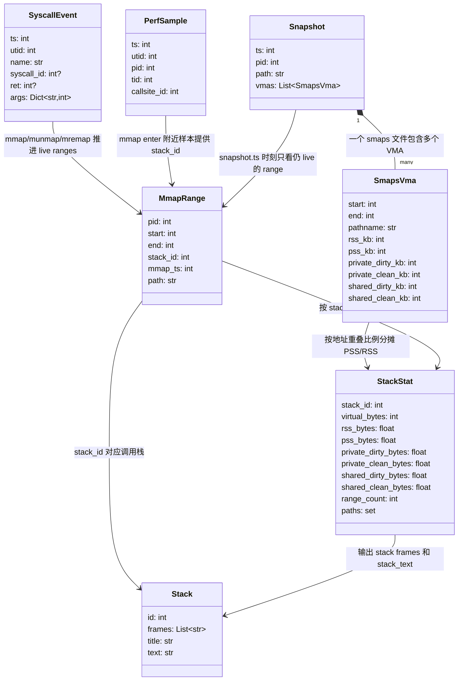

# mmap 真实物理内存归因 README

本工具用于回答一个问题：

```text
哪个 mmap 调用栈，最终占用了多少真实物理内存？
```

它不是只统计 mmap 的虚拟地址大小，而是把 Perfetto 中采到的 mmap 调用栈、mmap/munmap/mremap 生命周期，以及 `/proc/<pid>/smaps` 中的 PSS/RSS 快照做地址重叠归因，最终输出 Perfetto UI 和 Speedscope 可加载的 JSON。

默认入口同时采集 `mmap` 调用栈和 `libc.malloc` Native heap profile。本文把两个用途明确分开：

```text
主功能
  -> 采 mmap 调用栈，输出 mmap 物理内存归因 JSON 和 Speedscope 火焰图。

验证模式
  -> 不采 mmap 调用栈，只做无栈 mmap 事件健康检查。
```

无栈验证是测试功能，用来检查 mmap syscall 事件、smaps 和 meminfo 快照是否能被稳定采集，不能替代调用栈归因结果。无栈验证不启用 heapprofd malloc，也不做 malloc live 与 Native Heap Alloc 对比。

## 核心思路

```text
Perfetto raw_syscalls/sys_enter + sys_exit
  -> 还原 mmap / munmap / mremap 生命周期

Perfetto linux.process_stats + sched_switch
  -> 补齐 pid / thread 归属，避免无栈验证按目标进程过滤时误判为空

Perfetto linux.perf
  -> 在 mmap syscall enter 附近采样调用栈

/proc/<pid>/smaps
  -> 提供每个 VMA 当前真实物理占用：PSS / RSS / PrivateDirty

离线分析器
  -> 用 live mmap range 与 smaps VMA 做地址重叠
  -> 按调用栈聚合 PSS / RSS / virtual bytes
  -> 同一个 VMA 的 PSS/RSS 只归因一次；多个 mmap 命中同一 VMA 时按重叠权重分摊
```

优先看 `pss_bytes`。`rss_bytes` 对共享页会重复计数，适合作为辅助参考。

## 文件说明

```text
run_mmap_phys_profile.sh
  -> 默认入口脚本，使用写死默认配置启动采集和分析。

run_mmap_phys_analyze_latest.sh
  -> 离线分析包装脚本：默认使用最近一次 mmap 采集目录，补齐 fs.ini 分类和常用输出路径。

collect_mmap_phys_data.py
  -> 采集脚本：启动 Perfetto，周期拉 smaps，调用离线分析器，并生成内存总量验证报告。

mmap_phys_analyzer.py
  -> 离线分析器：读取 trace + smaps，输出归因 JSON。

test_mmap_phys_analyzer.py
  -> 单元测试，覆盖 mmap / munmap / smaps 归因、raw syscall 参数兼容、输出格式。
```

## 主功能：mmap 调用栈归因

主功能用于回答“哪个 mmap 调用栈最终占用了多少真实物理内存”。这是 `run_mmap_phys_profile.sh` 的默认行为，不需要额外参数：

```bash
./run_mmap_phys_profile.sh
```

默认入口会给离线分析器追加：

```bash
--classify-config heap_analyzer/fs.ini --top-n 0
```

因此默认结果会启用 `fs.ini` 分类，并让普通 Perfetto JSON / 默认 Speedscope 也保留全部
mmap 调用栈。显式传入新的 `--classify-config` 或 `--top-n` 时，用户参数会排在默认值
之后生效，只改变本次运行的输出口径。

默认目标进程：

```text
com.tencent.dhwdxkty.trunk.profiler
```

默认 trace processor：

```text
Linux 优先：
  $PerfettoRoot/out/linux_clang_release/trace_processor_shell

Windows Git Bash 优先：
  $PerfettoRoot/out/win_clang/trace_processor_shell.exe
  $PerfettoRoot/out/win/trace_processor_shell.exe
```

入口脚本会通过 `common_tools.sh` 自动选择 Python、`trace_processor_shell` 和
`traceconv`。如需覆盖，可显式设置：

```bash
PYTHON=python TRACE_PROCESSOR=/path/to/trace_processor_shell TRACECONV=/path/to/traceconv ./run_mmap_phys_profile.sh
```

如果需要脚本在目标进程不存在时自动拉起指定 Activity，可设置
`MMAP_PHYS_ACTIVITY=<package>/<activity>`。未设置时保留旧行为，只发送一次
launcher Intent。

运行前需要目标 App 已启动；脚本会等待目标进程出现。采集过程中可以触发 App 行为，例如：

```text
在手机上手动进入目标场景并执行需要观测的操作。
```

主功能采集和分析内容：

```text
linux.ftrace raw_syscalls
  -> 采 mmap / munmap / mremap 参数和返回值，用于还原 mmap 生命周期。

linux.perf callstack_sampling
  -> 在 mmap syscall enter 附近采目标进程调用栈。

/proc/<pid>/smaps
  -> 周期拉取 PSS / RSS / PrivateDirty 快照。

mmap_phys_analyzer.py
  -> 把 mmap live range 与 smaps VMA 做地址重叠，按 mmap 调用栈聚合 PSS / RSS / virtual bytes。
```

主功能输出：

```text
mmap_phys_attribution.json
  -> Perfetto UI 可加载的 mmap 调用栈物理内存归因结果。

mmap_phys_attribution.speedscope.json
  -> Speedscope 可加载的 mmap PSS 火焰图。

mmap_classification_summary.xlsx
  -> 默认 fs.ini 分类生成的 PSS/RSS/virtual 汇总表。

mmap_classification_summary.speedscope.json
  -> 默认 fs.ini 分类生成的分类汇总 Speedscope 火焰图。

memory_validation.json
  -> 随采集生成的验证报告；只作为量级校验，不是主功能结果。
```

主功能必须优先看 `mmap_phys_attribution.json` 和 Speedscope 火焰图。`memory_validation.json` 不能替代调用栈归因。

## 验证模式：无栈 mmap 事件健康校验

验证模式用于测试或改代码后的量级校验。它故意关闭 mmap 调用栈采样，但会保留 `raw_syscalls/sys_enter`、`raw_syscalls/sys_exit` 和线程归属所需事件作为兼容兜底；部分设备的 `syscall_events` 过滤不会产出事件，只依赖它会让 mmap 侧验证结果恒为 0。

```bash
./run_mmap_phys_profile.sh --no-mmap-callstacks
```

该模式不采 `android.heapprofd`。malloc 总量验证已经从无栈验证中删除；需要验证 Perfetto malloc 统计能力时，使用独立 heapprofd malloc APK demo。
运行无栈验证时脚本会先 `am force-stop` 目标 App，再启动 Perfetto，最后拉起目标 App，确保启动期 mmap syscall 不会在 Perfetto 就绪前漏掉。

验证模式采集和汇总内容：

```text
sys_mmap / sys_munmap / sys_mremap
  -> 不读取 mmap 调用栈，只还原无栈 mmap 生命周期。

最后一个 smaps 快照
  -> 与无栈 mmap live range 做地址重叠，汇总 mmap PSS / RSS / virtual bytes。

dumpsys meminfo
  -> 解析 Native Heap PSS / Native Heap Alloc / TOTAL PSS；报告保留 meminfo 作为快照参考，但不再做 malloc 对比。
```

验证模式输出：

```text
PerfData/mmap_phys/<时间戳>/
  -> 单轮无栈验证目录；通过或失败都会保留原始输入和报告。

memory_validation.json
  -> mmap 事件健康状态、mmap PSS 汇总和 meminfo 快照参考。

dumpsys_meminfo.txt
  -> adb shell dumpsys meminfo <package> 原始输出。

mmap_trace.perfetto-trace 和 smaps/
  -> 验证报告的原始输入。
```

验证模式不会生成新的 `mmap_phys_attribution.json` 和 `mmap_phys_attribution.speedscope.json`，因为当前运行没有采集 mmap 调用栈。它适合回答“无栈 mmap 事件是否能采到、smaps 是否能汇总”，不适合回答“哪个调用栈占了物理内存”，也不再回答“malloc live 是否接近 Native Heap Alloc”。

## 常用参数

```bash
./run_mmap_phys_profile.sh \
  --duration-ms 30000 \
  --smaps-interval-ms 1000
```

参数含义：

```text
--duration-ms
  -> Perfetto 采集时长，单位 ms。
  -> 默认 75000 ms，也就是 1 分 15 秒。

--smaps-interval-ms
  -> smaps 快照间隔，单位 ms。

--use-su
  -> 强制用 su 0 读取 /proc/<pid>/smaps。

--no-analyze
  -> 只采集 trace 和 smaps，不运行离线分析器。

--mmap-callstacks
  -> 采集 mmap 调用栈并运行 mmap 物理归因分析；这是默认主功能入口。

--no-mmap-callstacks
  -> 进入验证模式：不采 mmap 调用栈，只运行 mmap 事件健康检查。

--no-ftrace
  -> 不采 raw syscall 参数；只能调试 perf 调用栈，不适合最终归因。
```

说明：默认情况下，如果普通权限读取 smaps 得到 `Permission denied` 这类无效内容，采集脚本会自动尝试 `su 0`。

## Perfetto 采集配置

采集脚本会生成 `mmap_phys_config.pbtxt`。主功能核心配置如下：

```protobuf
data_sources {
  config {
    name: "linux.ftrace"
    ftrace_config {
      syscall_events: "sys_mmap"
      syscall_events: "sys_munmap"
      syscall_events: "sys_mremap"
      syscall_events: "sys_madvise"
      ftrace_events: "raw_syscalls/sys_enter"
      ftrace_events: "raw_syscalls/sys_exit"
      ftrace_events: "sched/sched_switch"
    }
  }
}

data_sources {
  config {
    name: "linux.process_stats"
    process_stats_config {
      scan_all_processes_on_start: true
    }
  }
}

data_sources {
  config {
    name: "linux.perf"
    perf_event_config {
      timebase {
        period: 1
        tracepoint {
          name: "raw_syscalls:sys_enter"
          filter: "id == 222"
        }
      }
      callstack_sampling {
        scope {
          target_cmdline: "com.tencent.dhwdxkty.trunk.profiler"
        }
        kernel_frames: true
      }
    }
  }
}
```

### `raw_syscalls` 与 `syscall_events` 的区别

两者都属于 syscall 相关采集，但层级和数据量不同：

```text
ftrace_events: "raw_syscalls/sys_enter"
ftrace_events: "raw_syscalls/sys_exit"
  -> 直接打开内核 raw syscall tracepoint。
  -> 事件形态通用，常见字段是 syscall id、args、ret。
  -> 不写过滤条件时会采全系统所有 syscall enter/exit，数据量很大。
  -> 适合做底层兼容、排查参数展开问题，或给 linux.perf tracepoint 采样对齐。

syscall_events: "sys_mmap"
syscall_events: "sys_munmap"
syscall_events: "sys_mremap"
  -> Perfetto FtraceConfig 的 syscall 子集配置。
  -> 按 syscall 名称声明只关心哪些 syscall，Perfetto 负责映射到底层事件。
  -> 只保留目标 syscall 的 enter/exit 信息，数据量远小于全系统 raw_syscalls。
  -> 适合验证模式这类只需要 mmap 生命周期、不需要 mmap 调用栈的场景。
```

注意不要混淆两处 `raw_syscalls`：

```text
linux.ftrace / ftrace_events / raw_syscalls/sys_enter
  -> 把 raw syscall 事件写进 trace，未过滤时会放大全系统 trace。

linux.perf / tracepoint / raw_syscalls:sys_enter / filter: "id == 222"
  -> 只把 raw syscall tracepoint 当作 perf 采样触发器，用来在 mmap enter 附近采调用栈。
  -> 这里有 id 过滤，不等同于采全系统 raw syscall 事件表。
```

因此：

```text
主功能
  -> 保留 syscall_events、raw_syscalls 和 linux.perf。
  -> 目标是 mmap 生命周期 + mmap 调用栈归因，优先保证参数、返回值和采样对齐信息完整。

验证模式
  -> 保留 syscall_events、raw_syscalls enter/exit、sched_switch 和 linux.process_stats，不采 linux.perf。
  -> 目标是无栈 mmap 事件健康检查，优先避免 mmap 事件缺失。
```

验证模式保留 `linux.ftrace` 和 `linux.process_stats`，不会生成 `linux.perf` 的 `callstack_sampling` 配置；因此验证模式不会采 mmap 调用栈，也不会运行 mmap 调用栈归因分析。当前 mmap 采集路径不生成 `android.heapprofd` 配置；需要验证 Perfetto malloc 统计能力时，使用独立 heapprofd malloc APK demo。

arm64 syscall id：

```text
mmap   -> 222
munmap -> 215
mremap -> 216
```

## 输出目录

默认输出目录：

```text
PerfData/mmap_phys/<时间戳>/
```

主功能一次成功运行会生成：

```text
mmap_phys_config.pbtxt
  -> 本次 Perfetto 采集配置。

mmap_trace.perfetto-trace
  -> 原始 Perfetto trace。

smaps/
  -> 多份 /proc/<pid>/smaps 快照。

mmap_phys_attribution.json
  -> 主功能输出：Perfetto UI 可加载的 Chrome JSON trace。

mmap_phys_attribution.speedscope.json
  -> 主功能输出：Speedscope 可加载的火焰图 JSON。

mmap_classification_summary.xlsx
  -> 传 --classify-config 时生成：按 fs.ini 层级分类的 PSS/RSS 汇总表。

mmap_classification_summary.speedscope.json
  -> 传 --classify-config 时生成：分类汇总 Speedscope 火焰图。

mmap_categories/
  -> 传 --classify-speedscope-dir mmap_categories 时生成：每分类 mmap 调用栈火焰图。

dumpsys_meminfo.txt
  -> `adb shell dumpsys meminfo <package>` 原始输出。
  -> 在 Perfetto 采样结束并拉回 trace 后立即保存，早于 trace 健康检查和离线分析。

memory_validation.json
  -> 随主功能一起生成的 mmap 事件健康报告和 meminfo 快照参考。
```

验证模式一次成功运行会生成：

```text
mmap_phys_config.pbtxt
  -> 本次 Perfetto 采集配置；不包含 linux.perf callstack_sampling。

mmap_trace.perfetto-trace
  -> 原始 Perfetto trace。

smaps/
  -> 多份 /proc/<pid>/smaps 快照。

dumpsys_meminfo.txt
  -> `adb shell dumpsys meminfo <package>` 原始输出。
  -> 在 Perfetto 采样结束并拉回 trace 后立即保存，避免分析耗时影响 meminfo 快照时点。

memory_validation.json
  -> 验证模式主输出：mmap 事件健康报告和 meminfo 快照参考。
```

实际验证过的输出示例：

```text
/home/dianhun/disk2/work/fsprofiler/PerfData/mmap_phys/2026-06-02_12-51-13/
  mmap_phys_config.pbtxt
  mmap_trace.perfetto-trace
  smaps/
  mmap_phys_attribution.json
  mmap_phys_attribution.speedscope.json
  dumpsys_meminfo.txt
  memory_validation.json
```

## smaps 提取 mmap 物理占用逻辑

### 口径定义

这里的“mmap 分配量”不是累计 mmap 调用参数里的 `length`，也不是 malloc
分配量。脚本统计的是：

```text
某个 smaps 快照时刻
  -> 目标进程仍然 live 的 mmap 地址区间
  -> 与 /proc/<pid>/smaps 当前 VMA 重叠的部分
  -> 按 smaps 的 PSS/RSS/Private/Shared 字段换算出的当前物理占用
```

因此它回答的是“当前哪些 mmap 调用栈最终占用了多少真实物理内存”，而不是
“从采集开始到现在累计 mmap 过多少虚拟地址空间”。

核心指标：

```text
pss_bytes
  -> 主判断口径。来自 smaps 的 Pss，按 mmap range 与 VMA 的重叠比例分摊。
  -> 共享页会按内核 PSS 规则分摊，适合看真实物理内存归因。

rss_bytes
  -> 来自 smaps 的 Rss，同样按重叠比例分摊。
  -> 共享页在不同进程间可能重复计数，不适合当作全局物理内存主口径。

virtual_bytes
  -> live mmap range 与 smaps VMA 的虚拟地址重叠大小。
  -> 只代表地址空间覆盖，不代表这些页已经实际驻留。

private_dirty_bytes / private_clean_bytes / shared_dirty_bytes / shared_clean_bytes
  -> 分别来自 smaps 同名字段，按同一重叠比例分摊。
```

### 数据输入

离线分析器使用两类输入：

```text
Perfetto trace
  -> raw_syscalls/sys_enter、raw_syscalls/sys_exit 或 syscall_events。
  -> 用来还原 mmap / munmap / mremap 生命周期。
  -> 主功能还会用 linux.perf 在 mmap enter 附近采样调用栈，得到 stack_id。

smaps/
  -> 采集期间周期性保存的 /proc/<pid>/smaps 快照。
  -> 文件名中的数字是采样时刻，采集脚本用设备 /proc/uptime 换算为 ns。
  -> 每个快照记录当前进程 VMA 的地址范围、pathname、Rss、Pss 等字段。
  -> 离线分析器默认会把采集脚本生成的 uptime ns 文件名按 ns 处理，避免把
     14 位 uptime ns 误当成 ms 放大，导致 Perfetto JSON 导入时出现负时间戳。
```

smaps 解析逻辑：

```text
VMA header:
  7100000000-7100100000 rw-p 00000000 00:00 0 [anon:test]
    -> start = 0x7100000000
    -> end   = 0x7100100000
    -> pathname = [anon:test]

VMA body:
  Rss:              64 kB
  Pss:              32 kB
  Private_Dirty:    16 kB
  Private_Clean:     0 kB
  Shared_Dirty:     48 kB
  Shared_Clean:      0 kB
```

脚本只使用当前实现中解析到的字段；`SwapPss` 目前不并入 `pss_bytes`。

### 数据结构关系

核心数据结构不是一条 mmap 对一条 smaps VMA，而是“调用栈、mmap 生命周期、
smaps 快照、VMA”之间的多对多关系：



关系说明：

```text
Stack
  -> trace_processor 的 stack_profile_callsite / stack_profile_frame /
     stack_profile_symbol 展开结果。

PerfSample
  -> linux.perf 在 mmap enter 附近采到的调用栈样本。
  -> sample.callsite_id 会成为 MmapRange.stack_id。

SyscallEvent
  -> ftrace syscall enter/exit 参数行分组后的事件。
  -> mmap exit ret 决定真实 start；munmap/mremap 用于删除或迁移 live range。

MmapRange
  -> 当前时间轴上仍然存活的虚拟地址区间。
  -> 它记录“这段地址最初由哪个 stack_id 的 mmap 建立”，但不直接记录物理页。

Snapshot / SmapsVma
  -> 某一时刻 /proc/<pid>/smaps 的完整快照。
  -> VMA 记录当前地址段的 PSS/RSS/Private/Shared 等物理占用字段。

StackStat
  -> 某个 snapshot 上，所有 VMA 与 live mmap range 地址重叠后，
     按 stack_id 聚合出来的物理占用结果。
```

可以把它理解成两条时间线在快照点相交：

```text
Perfetto syscall 时间线
  -> 维护 live MmapRange 集合：哪些 mmap 地址段此刻还没被 munmap/mremap 移走。

smaps 快照时间线
  -> 周期提供 VMA 当前物理状态：这些地址段此刻有多少 PSS/RSS/PrivateDirty。

归因点 snapshot.ts
  -> 用 snapshot.ts 之前的 syscall 事件得到 live ranges。
  -> 用 snapshot.ts 对应的 smaps VMA 得到当前物理页。
  -> 通过地址重叠把 VMA 物理页分摊给建立这些 range 的 mmap 调用栈。
```

### mmap 生命周期还原

Perfetto syscall 行会先按事件 id 分组，再规范化参数名：

```text
raw_syscalls/sys_enter
  id / syscall_nr / nr -> syscall id
  args[0] / arg0 / addr / start -> 起始地址参数
  args[1] / arg1 / len / length -> 长度参数

raw_syscalls/sys_exit
  ret / retval / return_value -> syscall 返回值
```

生命周期事件生成规则：

```text
mmap
  enter 记录 length。
  exit ret >= 0 时，ret 是实际映射起始地址。
  生成 live range:
    [ret, ret + length) -> stack_id

munmap
  enter 记录 addr 和 length。
  exit ret >= 0 时，从 live ranges 中删除 [addr, addr + length)。
  如果只释放中间一段，会把原 range 切成前后两段。

mremap
  enter 记录 old_addr / old_size / new_size。
  exit ret >= 0 时，删除旧 range，再加入 [ret, ret + new_size)。
```

`MAP_FIXED` 或其他覆盖场景下，新增 mmap range 前会先切掉同 pid 的重叠旧
range，保证 live ranges 尽量保持不重叠。

主功能中，mmap range 的 `stack_id` 来自 mmap enter 附近的 perf sample：

```text
mmap enter 时间点
  -> 在同 utid 的 perf samples 里找最近样本
  -> 默认窗口 --stack-window-ns=5000000
  -> 命中后把 sample.callsite_id 作为该 mmap range 的 stack_id
```

无栈验证模式没有 mmap 调用栈，生命周期仍可还原，但所有 mmap range 使用
`stack_id = 0`，只用于健康检查和总量汇总。

### 快照归因流程

采集脚本会按 `--smaps-interval-ms` 周期保存多份 smaps：

```text
collect_smaps()
  -> 每轮读取设备 /proc/uptime
  -> 用 uptime ns 作为文件名：<ts_ns>.smaps
  -> 保存 /proc/<pid>/smaps 原文
```

离线分析器读取这些文件时，会从文件名提取时间戳，按时间排序：

```text
load_snapshots(smaps_dir)
  -> parse_timestamp_from_name(<ts_ns>.smaps)
  -> parse_smaps(path)
  -> Snapshot(ts=<ts_ns>, pid=<target_pid>, path=path, vmas=[...])
  -> 按 Snapshot.ts 升序排列
```

多个 smaps 快照的使用逻辑如下：

```text
1. 不是把所有 smaps VMA 直接相加。
   每个 smaps 文件都是一个瞬时状态；不同文件表示不同时刻的同一进程地址空间。

2. 如果只要“最新物理内存占用”，理论上只需要最后一个 smaps 快照。
   做法是先把 mmap/munmap/mremap 生命周期推进到最后一个 snapshot.ts，
   得到该时刻仍 live 的 mmap ranges，再与最后一个 smaps VMA 做地址重叠。
   这就是 metadata.final_summary 和默认 Speedscope 的最终口径。

3. 当前实现仍会按时间从早到晚处理每个快照。
   对每个 snapshot.ts，只先应用 event.ts <= snapshot.ts 的 mmap/munmap/mremap
   生命周期事件，得到该时刻仍 live 的 mmap ranges。

4. 每个快照单独做一次地址重叠归因。
   这个快照的 PSS/RSS 只用于生成该时刻的 Perfetto counter。
   多个周期的重叠计算服务于时间线展示、增长/回落观察和采集健康诊断，
   不是把最终物理占用算出来的必要条件。

5. final_summary 和默认 Speedscope 使用最后一个 smaps 快照。
   build_chrome_trace() 每处理一个快照都会更新 final_stats，循环结束后用最终
   final_stats 生成 metadata.final_summary 和 Speedscope。

6. memory_validation.json 的无栈 mmap 汇总也使用相同推进逻辑。
   它会遍历所有快照，但最终报告的 mmap.pss_bytes 来自最后一个快照的 final_stats。
```

因此，你如果只关心最新时刻的真实物理内存归因，可以把逻辑简化成：

```text
last_snapshot = smaps 快照中时间戳最大的那个
live_ranges_at_last_snapshot = 所有 event.ts <= last_snapshot.ts 的生命周期结果
最终 PSS/RSS = live_ranges_at_last_snapshot 与 last_snapshot.vmas 地址重叠后的分摊结果
```

示意时间线：

```text
trace event:
  t=10 mmap A [0x1000, 0x5000) stack=11
  t=20 mmap B [0x8000, 0xa000) stack=22
  t=30 munmap [0x2000, 0x3000)
  t=40 mremap B -> [0xc000, 0xe000)

smaps snapshots:
  S1 t=15  -> live: A
  S2 t=25  -> live: A + B
  S3 t=35  -> live: A 被切成 [0x1000,0x2000)+[0x3000,0x5000), B
  S4 t=45  -> live: A 两段, B 已迁移到 [0xc000,0xe000)

输出：
  Perfetto counter 会有 S1/S2/S3/S4 四个时刻。
  metadata.final_summary 使用 S4 的归因结果。
  Speedscope 权重也使用 S4 的 pss_bytes。
```

对每个 smaps 快照，分析器按时间推进 live ranges：

```text
按时间排序的 mmap 生命周期事件
        |
        v
处理所有 event.ts <= snapshot.ts 的事件
        |
        v
得到 snapshot.ts 时刻仍然 live 的 mmap ranges
        |
        v
把 live ranges 与当前 smaps VMA 做地址重叠
        |
        v
按重叠比例把 VMA 的 PSS/RSS 等字段分摊到 stack_id
```

有限长度 range 的重叠计算：

```text
overlap = max(0, min(vma.end, range.end) - max(vma.start, range.start))

如果 overlap > 0:
  这条 mmap range 与该 VMA 有交集。
```

分摊比例：

```text
vma_size = max(1, vma.end - vma.start)
total_overlap = 当前 VMA 命中的所有 mmap range overlap 之和
denominator = max(vma_size, total_overlap)
ratio = overlap / denominator
```

使用 `max(vma_size, total_overlap)` 的原因是避免同一个 VMA 被多个调用栈重复归因。
如果多个 range 都命中同一个 VMA，PSS/RSS 会按 overlap 权重分摊，而不是每个
range 都拿一份完整 VMA PSS。

字段换算：

```text
stat.virtual_bytes       += vma_size * ratio
stat.pss_bytes           += vma.pss_kb * 1024 * ratio
stat.rss_bytes           += vma.rss_kb * 1024 * ratio
stat.private_dirty_bytes += vma.private_dirty_kb * 1024 * ratio
stat.private_clean_bytes += vma.private_clean_kb * 1024 * ratio
stat.shared_dirty_bytes  += vma.shared_dirty_kb * 1024 * ratio
stat.shared_clean_bytes  += vma.shared_clean_kb * 1024 * ratio
```

### 单次 mmap 物理占用计算示例

先看最简单的一对一场景：一次 mmap 的 live range 完全覆盖一个 smaps VMA。

```text
mmap 调用：
  stack_id = 101
  ret      = 0x70000000
  length   = 0x4000  # 16 KiB
  live range = [0x70000000, 0x70004000)

同一 snapshot.ts 的 smaps VMA：
  70000000-70004000 rw-p 00000000 00:00 0 [anon:demo]
  Rss:              16 kB
  Pss:              16 kB
  Private_Dirty:    12 kB
  Private_Clean:     4 kB
  Shared_Dirty:      0 kB
  Shared_Clean:      0 kB
```

计算：

```text
vma_size = 0x4000 = 16384 bytes
overlap  = min(0x70004000, 0x70004000) - max(0x70000000, 0x70000000)
         = 0x4000 = 16384 bytes

total_overlap = 16384
denominator   = max(vma_size, total_overlap) = 16384
ratio         = overlap / denominator = 1.0

stack_id=101:
  virtual_bytes       += 16384 * 1.0 = 16384
  pss_bytes           += 16 * 1024 * 1.0 = 16384
  rss_bytes           += 16 * 1024 * 1.0 = 16384
  private_dirty_bytes += 12 * 1024 * 1.0 = 12288
  private_clean_bytes +=  4 * 1024 * 1.0 = 4096
```

这个结果说明：虽然 mmap 请求的是 16 KiB 虚拟地址，但 `pss_bytes` 只来自
当前 smaps 的 `Pss`。如果这 16 KiB 从未触页，smaps 里 `Pss: 0 kB`，则
`virtual_bytes` 仍可能是 16384，但 `pss_bytes` 会是 0。

再看一个“一个 VMA 被多个 mmap range 命中”的场景。内核可能合并相邻匿名映射，
smaps 看到的是一个 16 KiB VMA，但 Perfetto 生命周期里保留了两次 mmap 来源：

```text
mmap A:
  stack_id = 101
  live range = [0x70000000, 0x70002000)  # 8 KiB

mmap B:
  stack_id = 202
  live range = [0x70002000, 0x70004000)  # 8 KiB

smaps VMA:
  70000000-70004000 rw-p 00000000 00:00 0 [anon:merged]
  Rss:              16 kB
  Pss:              12 kB
  Private_Dirty:     8 kB
  Private_Clean:     4 kB
```

计算：

```text
vma_size = 16 KiB

A overlap = 8 KiB
B overlap = 8 KiB
total_overlap = 16 KiB
denominator = max(16 KiB, 16 KiB) = 16 KiB

A ratio = 8 / 16 = 0.5
B ratio = 8 / 16 = 0.5

stack_id=101:
  virtual_bytes       += 16 KiB * 0.5 = 8 KiB
  pss_bytes           += 12 KiB * 0.5 = 6 KiB
  private_dirty_bytes +=  8 KiB * 0.5 = 4 KiB
  private_clean_bytes +=  4 KiB * 0.5 = 2 KiB

stack_id=202:
  virtual_bytes       += 8 KiB
  pss_bytes           += 6 KiB
  private_dirty_bytes += 4 KiB
  private_clean_bytes += 2 KiB
```

重点是：这个 VMA 的 `Pss: 12 kB` 只被分出去一次。两个调用栈加起来仍是
12 KiB，不会变成 24 KiB。

再看一个部分重叠场景。mmap 请求了 64 KiB，但当前 smaps 只有其中 16 KiB 的
VMA 有驻留页：

```text
mmap:
  stack_id = 303
  live range = [0x71000000, 0x71010000)  # 64 KiB

smaps VMA:
  71004000-71008000 rw-p 00000000 00:00 0 [anon:partial]
  Pss: 8 kB
  Rss: 16 kB
```

计算：

```text
vma_size = 16 KiB
overlap = 16 KiB
ratio = 1.0

stack_id=303:
  virtual_bytes += 16 KiB
  pss_bytes     += 8 KiB
  rss_bytes     += 16 KiB
```

这里不会因为 mmap 原始 length 是 64 KiB，就把 `virtual_bytes` 记成 64 KiB。
当前实现统计的是“live mmap range 与当前 smaps VMA 的重叠部分”，没有对应
smaps VMA 的地址段不会贡献 PSS/RSS，也不会贡献本次归因的 `virtual_bytes`。

### raw syscall 缺少 length 的兜底

部分设备或 Perfetto/ftrace 组合下，raw syscall 能拿到 mmap 返回地址，但拿不到
可靠 length。此时脚本会把该 mmap 记录成“点 range”：

```text
start = mmap 返回地址
end <= start
```

归因时，如果这个点落在某个 smaps VMA 内，就用该 VMA 作为归因范围：

```text
vma.start <= range.start < vma.end
  -> candidates.append((range, vma_size))
```

这个兜底用于避免“有 mmap 返回地址但没有 length”时完全丢失物理归因。它比有限
长度 range 粗糙：同一 VMA 内多个未知长度 mmap 会按候选数量和重叠权重分摊，
不会让 Speedscope 总 PSS 超过 smaps 原始 PSS，但调用栈粒度会受 VMA 合并影响。

### 输出和 top_n 的关系

每个快照都会输出一个总量 counter：

```text
total mmap PSS/RSS
  -> 当前 snapshot 中所有 stack_id 的 PSS/RSS 汇总
  -> 不受 --top-n 截断影响
```

每个调用栈的明细 counter 和最终 `metadata.final_summary` 会按 PSS 排序后受
`--top-n` 控制：

```text
--top-n 50
  -> 每个快照只输出 PSS 最大的前 50 个调用栈明细。
  -> metadata.final_summary 也只保留最终快照前 50 个调用栈。

--top-n 0
  -> 不截断，输出全部调用栈明细。
  -> 适合总量核对或直接排查长尾调用栈。
```

内置 fs.ini 分类输出不直接复用被 `--top-n` 截断的 `metadata.final_summary`。启用
`--classify-config` 时，分析器会在同一次最终快照上额外构造一份全量 summary，
等价于分类数据源内部强制使用 `--top-n 0`。因此：

```text
普通 Perfetto JSON / 默认 Speedscope
  -> 仍受 --top-n 控制，避免输出过大。

分类 summary / 分类 Speedscope
  -> 使用全量调用栈 summary，不受 --top-n 截断。
  -> 只要最终快照中有该调用栈，分类统计就会覆盖到。
```

### 局限和校验

需要注意的边界：

```text
smaps 是快照
  -> 只能表示采样时刻的当前驻留/分摊状态。
  -> 不能表示历史累计 mmap length，也不能表示已经 munmap 的历史区间。

PSS 是物理占用口径
  -> 只统计当前 smaps Pss 中可见的驻留分摊。
  -> 当前脚本没有把 SwapPss 并入 pss_bytes。

VMA 可能被内核拆分或合并
  -> mmap 调用栈和 smaps VMA 不是一对一关系。
  -> 脚本通过地址重叠和比例分摊处理多对多关系。

时间戳需要对齐
  -> 采集脚本默认用设备 /proc/uptime 生成 smaps 文件名。
  -> 离线重跑时如发现 smaps 与 trace 时间轴偏移，可用 --smaps-ts-offset-ns 调整。
```

基本校验：

```text
sum(metadata.final_summary[].pss_bytes)
  <= 最终快照 total mmap PSS/RSS counter 中的 pss_bytes
  <= 同一 smaps 文件原始 PSS 总和

Speedscope sum(weights)
  <= sum(metadata.final_summary[].pss_bytes)
```

如果 Speedscope 或 final_summary 的 PSS 大于同一快照原始 smaps PSS，优先怀疑
同一 VMA 被多个调用栈重复归因，或使用了不匹配的 smaps 快照和 trace 时间轴。

## 多周期归因结果怎么看

多周期归因结果主要看 `mmap_phys_attribution.json`，不要用默认 Speedscope 判断
增长/回落过程。默认 Speedscope 使用最后一个 smaps 快照的 `pss_bytes` 生成火焰图，
适合看最终时刻“哪个调用栈占得最多”；Perfetto JSON 里的 counter 才能看每个
smaps 周期的变化。

查看路径：

```text
PerfData/mmap_phys/<时间戳>/mmap_phys_attribution.json
```

可视化关系：

```text
多个 smaps 快照
  -> 每个快照独立做一次 live mmap range 与 smaps VMA 地址重叠
  -> 生成一个 total mmap PSS/RSS counter 点
  -> 每个调用栈生成一个 mmap stack PSS counter 点

Perfetto UI
  -> 看 total 曲线：整体 mmap 物理占用是否上涨/回落
  -> 看 stack 曲线：哪个 mmap 调用栈在某段时间增长
  -> 点开 counter 样本：看 pss_bytes、rss_bytes、live_ranges 等数值
  -> 点开同时间点 details 事件：看 smaps 文件、paths 和完整 stack
```

### Perfetto UI 查看

用 Perfetto UI 打开 `mmap_phys_attribution.json` 后，重点看进程：

```text
mmap physical attribution
```

核心 counter：

```text
total mmap PSS/RSS
  -> 每个 smaps 周期一个总量点。
  -> args.pss_bytes 是该时刻所有 mmap 调用栈归因后的 PSS 汇总。
  -> args.rss_bytes 是该时刻 RSS 汇总，辅助判断共享页和驻留规模。
  -> args.live_ranges 是该时刻仍然 live 的 mmap range 数量。

mmap stack PSS
  -> 每个调用栈一条 counter 轨道。
  -> args.pss_bytes 是该调用栈在当前 smaps 快照时刻的 PSS。
  -> args.virtual_bytes 是该调用栈 live range 与当前 VMA 的虚拟地址重叠大小。
  -> args.range_count 是该调用栈命中的 range/VMA 重叠次数。

mmap snapshot details
  -> 与 total mmap PSS/RSS 同时间点的 instant 事件。
  -> args.smaps 是该周期对应的 smaps 原始文件。

mmap stack details
  -> 与 mmap stack PSS 同时间点、同 tid 的 instant 事件。
  -> args.paths 是命中的 smaps VMA pathname 摘要。
  -> args.stack 是完整 mmap 调用栈。
```

注意：`total mmap PSS/RSS` 和 `mmap stack PSS` 是 Chrome JSON counter
事件，`args` 必须只放数值。`smaps`、`paths`、`stack` 这类字符串详情放在
同时间点的 `mmap snapshot details` / `mmap stack details` instant 事件里。
否则 trace_processor 会把字符串当作 counter 值解析失败，并报告
`json_parser_failure`。

判断方式：

```text
total mmap PSS/RSS 上涨
  -> 当前 smaps 快照里，更多 mmap VMA 产生了真实驻留页，或共享页分摊增加。

total mmap PSS/RSS 回落
  -> munmap/mremap 后 live range 消失，或页面被回收、共享比例变化。

live_ranges 增加但 pss_bytes 不涨
  -> 可能只是 mmap 了虚拟地址，还没有触页；也可能映射存在但当前没有 PSS。

某条 mmap stack PSS 上涨
  -> 该调用栈建立的 live range 对应 VMA 在后续 smaps 快照中出现更多 PSS。

pss_bytes 大幅跳变
  -> 点开同时间点的 mmap snapshot details，记录 args.smaps，
     再查看同一 smaps 文件中的 VMA 原始字段。
```

### 命令行查看

查看每个 smaps 周期的总量变化：

```bash
jq '.traceEvents[]
  | select(.name=="total mmap PSS/RSS")
  | {
      ts,
      pss_bytes: .args.pss_bytes,
      rss_bytes: .args.rss_bytes,
      live_ranges: .args.live_ranges
    }' PerfData/mmap_phys/<时间戳>/mmap_phys_attribution.json
```

查看每个 smaps 周期对应的原始 smaps 文件：

```bash
jq '.traceEvents[]
  | select(.name=="mmap snapshot details")
  | {
      ts,
      smaps: .args.smaps
    }' PerfData/mmap_phys/<时间戳>/mmap_phys_attribution.json
```

查看每个调用栈在各周期的变化：

```bash
jq '.traceEvents[]
  | select(.name=="mmap stack PSS")
  | {
      ts,
      pss_bytes: .args.pss_bytes,
      rss_bytes: .args.rss_bytes,
      virtual_bytes: .args.virtual_bytes,
      range_count: .args.range_count
    }' PerfData/mmap_phys/<时间戳>/mmap_phys_attribution.json
```

查看调用栈详情和命中的 VMA pathname：

```bash
jq '.traceEvents[]
  | select(.name=="mmap stack details")
  | {
      ts,
      stack_id: .args.stack_id,
      paths: .args.paths,
      stack: .args.stack
    }' PerfData/mmap_phys/<时间戳>/mmap_phys_attribution.json
```

只看 PSS 非零的调用栈周期点：

```bash
jq '.traceEvents[]
  | select(.name=="mmap stack PSS")
  | select((.args.pss_bytes // 0) > 0)
  | {
      ts,
      pss_bytes: .args.pss_bytes,
      rss_bytes: .args.rss_bytes,
      virtual_bytes: .args.virtual_bytes,
      range_count: .args.range_count
    }' PerfData/mmap_phys/<时间戳>/mmap_phys_attribution.json
```

命令行输出里的 `ts` 是 Perfetto JSON counter 时间，单位是微秒。要回查原始
smaps，优先使用同时间点 `mmap snapshot details` 里的 `smaps` 路径，而不是手动按
`ts` 猜文件名。

## 结果怎么看

### Perfetto JSON

打开：

```text
PerfData/mmap_phys/<时间戳>/mmap_phys_attribution.json
```

可用 Perfetto UI 加载。重点看：

```text
traceEvents
  -> 时间线 counter。

metadata.final_summary
  -> 最后一个 smaps 快照时刻的最终归因结果。
```

`metadata.final_summary` 中每一项代表一条 mmap 调用栈：

```json
{
  "pss_bytes": 4096,
  "rss_bytes": 8192,
  "virtual_bytes": 8192,
  "private_dirty_bytes": 4096,
  "range_count": 1,
  "paths": ["/dev/ashmem/MemoryHeapBase (deleted)"],
  "stack": [
    "syscall_trace_enter [kernel]",
    "el0_svc_common [kernel]",
    "mmap [libc.so]",
    "_ZN7android14MemoryHeapBase5mapfdEibml [libbinder.so]"
  ],
  "stack_text": "..."
}
```

字段说明：

```text
pss_bytes
  -> 推荐使用的真实物理内存归因大小。

rss_bytes
  -> RSS 归因大小，共享页可能重复计数。

virtual_bytes
  -> 当前 live mmap range 与 smaps VMA 的虚拟地址重叠大小。

private_dirty_bytes
  -> smaps Private_Dirty 归因大小。

range_count
  -> 这条调用栈当前匹配到的 live range / VMA 重叠次数。

paths
  -> smaps VMA pathname，例如 /dev/mali0、ashmem、anon 区域。

stack
  -> 完整 mmap 调用栈。
```

### Speedscope 火焰图

打开：

```text
PerfData/mmap_phys/<时间戳>/mmap_phys_attribution.speedscope.json
```

加载到：

```text
https://www.speedscope.app/
```

火焰图权重单位是 bytes，当前按 `pss_bytes` 输出。也就是说，PSS 为 0 的 mmap 调用栈不会出现在 Speedscope 权重中，但仍会保留在 Perfetto JSON 的 `metadata.final_summary` 里。

校验口径：

```text
Speedscope total_weight
  <= metadata.final_summary 中的 PSS 汇总
  <= Perfetto JSON 里的 total mmap PSS/RSS counter
  <= 同一 smaps 快照的原始总 PSS
```

如果 Speedscope 总权重大于目标进程 smaps 原始 PSS，说明归因重复计数，不能把该火焰图当作物理内存结果。

### fs.ini 分类输出

`mmap_phys_analyzer.py` 可以复用 heap 分析脚本同一套 fs.ini 分类规则。规则格式：

```ini
# il2cpp/meta
Class::Init
MetadataCache

# graphics/gpu
libGLES
libvulkan
```

分类规则按文件顺序匹配。某条 mmap 调用栈命中一个分类后，不会再进入后续分类；
未命中的调用栈进入 `remaining`。分类名中的 `/` 会生成父子层级，父节点聚合所有
子分类。

离线分析示例：

```bash
python -u -B mmap_phys_analyzer.py \
  --trace PerfData/mmap_phys/<时间戳>/symbolized-trace \
  --smaps-dir PerfData/mmap_phys/<时间戳>/smaps \
  --pid <pid> \
  --output PerfData/mmap_phys/<时间戳>/mmap_phys_attribution.json \
  --speedscope-output PerfData/mmap_phys/<时间戳>/mmap_phys_attribution.speedscope.json \
  --classify-config heap_analyzer/fs.ini \
  --classify-speedscope-dir mmap_categories \
  --top-n 50
```

上例中普通 JSON 和默认 Speedscope 只保留前 50 个调用栈；分类输出仍使用全量最终
summary，相当于分类口径使用 `--top-n 0`。

分类输出文件：

```text
mmap_classification_summary.xlsx
  -> 默认写到 --output 同级目录。
  -> Summary sheet 输出全量、classified_total、remaining 的 PSS/RSS/virtual 汇总。
  -> Tree sheet 按 fs.ini 的 / 层级输出父分类、叶子分类和 remaining。

mmap_classification_summary.speedscope.json
  -> 默认写到 --output 同级目录。
  -> 每个叶子分类和 remaining 作为一个 sample，权重是 pss_bytes。

mmap_categories/*.speedscope.json
  -> 只有传 --classify-speedscope-dir 时生成。
  -> 每个分类叶子、父分类和 remaining 各输出一个 mmap 调用栈火焰图。
```

可选路径参数：

```text
--classify-summary-out
  -> 指定分类 xlsx 路径；相对路径写到 --output 同级目录。

--classify-summary-speedscope-out
  -> 指定分类汇总 speedscope 路径；相对路径写到 --output 同级目录。

--classify-speedscope-dir
  -> 指定每分类 speedscope 目录；相对路径写到 --output 同级目录。
```

分类主指标仍是 `pss_bytes`。`rss_bytes`、`virtual_bytes`、
`private_dirty_bytes`、`private_clean_bytes`、`shared_dirty_bytes` 和
`shared_clean_bytes` 会一起写入 xlsx，便于和原始 smaps 口径对账。

### 验证报告 memory_validation.json

打开：

```text
PerfData/mmap_phys/<时间戳>/memory_validation.json
```

验证报告属于“验证模式”口径，用于回答：

```text
无栈 mmap syscall 事件是否可采；
smaps 是否能与无栈 mmap 生命周期汇总出最终 PSS；
dumpsys meminfo 是否已在采样结束后保存为同一轮验证的参考快照。
```

验证流程：

```text
sys_mmap / sys_munmap / sys_mremap
  -> 不读取 mmap 调用栈
  -> 与最后一个 smaps 快照做地址重叠，汇总 mmap PSS/RSS/virtual bytes

dumpsys meminfo
  -> 解析 Native Heap PSS / Native Heap Alloc / TOTAL PSS
  -> 采样结束后立即获取，后续 trace 健康检查和离线分析只复用这个文件
```

关键字段：

```text
mmap.pss_bytes
  -> 无栈 mmap 生命周期与 smaps 交叉后的 PSS 汇总。

meminfo.native_heap_alloc_bytes
  -> dumpsys meminfo Native Heap 的 Heap Alloc；无栈验证只记录该快照字段，不与 malloc live 对比。

trace_health.heapprofd_data_loss
  -> 来自 trace_processor stats 中的 heapprofd_buffer_overran /
     heapprofd_missing_packet / heapprofd_non_finalized_profile 汇总。
  -> 无栈验证不启用 heapprofd，正常不会出现该问题；如果主功能启用 heapprofd 时大于 0，
     表示 malloc profile 数据不完整，脚本会在终端输出 WARN。

trace_health.heapprofd_errors
  -> 来自 trace_processor stats 中的 heapprofd_client_error 汇总。
  -> 无栈验证不启用 heapprofd，正常不会出现该问题；主功能启用 heapprofd 时大于 0
     会在 validation.issues 中写入 heapprofd_errors。
```

注意：验证报告是测试口径，主要看 mmap 事件健康和 smaps 汇总是否可用。它不提供调用栈归因，也不替代 `mmap_phys_attribution.json` 和 Speedscope 火焰图。

## 独立 heapprofd malloc APK demo

malloc 总量验证已从无栈验证中删除。需要隔离验证 Perfetto/heapprofd 的
malloc 数据统计功能是否正常时，应运行独立 APK demo。

```bash
TOTAL_BYTES=1073741824 \
START_DELAY_SECONDS=10 \
ALLOC_SECONDS=60 \
HOLD_SECONDS=20 \
MALLOC_SHMEM_SIZE_BYTES=268435456 \
./run_heapprofd_malloc_apk_demo.sh
```

demo 只验证 malloc 分配量，不叠加超深调用栈，避免调用栈展开成本干扰分配量口径。
默认场景会在 1 分钟内累计 malloc 1 GiB，每次分配大小按 1 byte 到 1 MiB 的范围变化，
每块内存都会写入以确保 Native Heap PSS 能反映真实驻留。

Windows Git Bash 下脚本会探测 Unity Android SDK/NDK/OpenJDK，使用 NDK
`clang`、`dx.jar`、`apksigner.jar` 和 JDK `jar` 构建 APK，避免 `.cmd/.bat`
工具路径空格导致的执行问题。demo APK 的 `targetSdkVersion` 为 24，以满足当前设备安装限制。

demo 报告路径：

```text
PerfData/heapprofd_malloc_apk_demo/<时间戳>/malloc_demo_report.json
```

关键字段：

```text
demo.expected_live_bytes
  -> demo 持有的 malloc 分配总量。

demo.mallinfo_uordblks
  -> App 进程内 mallinfo() 看到的 Native Heap 已分配量。

heapprofd.cumulative.live_bytes
  -> heap_profile_allocation 全窗口累计净 live bytes；这是 continuous dump 下用于
     对比分配量的主口径。

heapprofd.latest_dump.live_bytes
  -> max(ts) 分片口径，仅用于暴露 continuous dump 的口径差异，不作为分配量主判断。

meminfo.native_heap_alloc_bytes
  -> dumpsys meminfo Native Heap 的 Heap Alloc。

meminfo.native_heap_pss_plus_swap_pss_bytes
  -> Native Heap PSS + SwapPss；设备发生换出时，单看 PSS 可能低于 Heap Alloc。
```

## 离线单独分析

如果已经有 trace 和 smaps，优先使用离线包装脚本分析最近一次采集：

```bash
./run_mmap_phys_analyze_latest.sh
```

包装脚本默认行为：

```text
PerfData/mmap_phys/<最近时间戳>/
  -> 优先读取 symbolized-trace；没有时回退 mmap_trace.perfetto-trace
  -> 读取 smaps/
  -> 未传 --pid 时，按 MMAP_PHYS_APP 从 trace 中查询目标 pid
  -> 输出 mmap_phys_attribution.json
  -> 输出 mmap_phys_attribution.speedscope.json
  -> 输出 mmap_classification_summary.xlsx
  -> 输出 mmap_classification_summary.speedscope.json
  -> 输出 mmap_categories/*.speedscope.json
```

默认追加给 `mmap_phys_analyzer.py` 的参数：

```bash
--classify-config heap_analyzer/fs.ini \
--classify-speedscope-dir mmap_categories \
--top-n 0
```

用户参数会追加在默认参数之后，因此可以覆盖本次分析口径：

```bash
./run_mmap_phys_analyze_latest.sh --pid 1234 --top-n 25
```

如果目标进程不是默认包名，可以设置环境变量让 wrapper 自动查询 pid：

```bash
MMAP_PHYS_APP=com.example.app ./run_mmap_phys_analyze_latest.sh
```

需要完全指定 trace、smaps 或输出路径时，也可以继续直接运行底层分析器：

```bash
python -u -B mmap_phys_analyzer.py \
  --trace PerfData/mmap_phys/<时间戳>/symbolized-trace \
  --smaps-dir PerfData/mmap_phys/<时间戳>/smaps \
  --pid <目标 pid> \
  --output PerfData/mmap_phys/<时间戳>/mmap_phys_attribution.json \
  --speedscope-output PerfData/mmap_phys/<时间戳>/mmap_phys_attribution.speedscope.json \
  --trace-processor $PerfettoRoot/out/linux_clang_release/trace_processor_shell
```

如果目录中没有 `symbolized-trace`，可以退回使用 `mmap_trace.perfetto-trace`，
但 `libil2cpp.so` 等业务 so 可能只显示地址或不完整函数名。

## 性能实现说明

`collect_mmap_phys_data.py --no-mmap-callstacks` 的无栈验证只查询目标进程
mmap/munmap/mremap syscall 和 `stats` 健康信息，不读取
`stack_profile_callsite`、`stack_profile_frame`、`stack_profile_symbol` 或
`__intrinsic_perf_sample`，避免把调用栈开销带回无栈验证。

默认主功能启用 mmap 调用栈时，采集后会调用 `mmap_phys_analyzer.py` 做离线分析。
这里先复用 `heap_profile.py` 的符号化流程：使用 `traceconv symbolize` 按
`PERFETTO_BINARY_PATH` 生成 `symbols`，再把原始 `mmap_trace.perfetto-trace`
和 `symbols` 拼成 `symbolized-trace`。离线分析器读取 `symbolized-trace`，
这样 `libil2cpp.so` 等业务 so 才能按 `workspace/allsymbols/arm64-v8a`
中的符号文件解析。

离线分析阶段再复用 Native heap 符号查询脚本的性能思路：

```text
traceconv symbolize 生成 symbolized-trace
        |
        v
trace_processor query 导出基础表
        |
        v
按目标 pid 先缩小 ftrace syscall 事件，再读取 args
        |
        v
Python 内存中展开 stack_profile_callsite parent 链和 inline frame
        |
        v
优先使用 frame.symbol_set_id -> stack_profile_symbol.name 作为 UI 一致符号名，
每个 inline 符号作为独立 frame 输出到 Speedscope
```

这样避免在 trace_processor SQL 里递归展开调用栈；同时 syscall 查询不会先全量扫描
所有进程的 `__intrinsic_args`。

## 单元测试

运行：

```bash
python -B -m unittest -v test_mmap_phys_analyzer.py
bash test_run_mmap_phys_profile.sh
bash test_run_mmap_phys_analyze_latest.sh
```

覆盖内容：

```text
1. trace_processor stderr 日志不会污染 CSV。
2. raw_syscalls repeated args 会按顺序展开成 arg0 / arg1。
3. 默认主功能和验证模式都包含 raw_syscalls/sys_enter、raw_syscalls/sys_exit、sched_switch 和 linux.process_stats；验证模式不采 linux.perf 调用栈。
4. smaps 普通读取无效时会自动尝试 su 0。
5. mmap + perf sample + munmap 会正确归因到 smaps PSS。
6. raw syscall 缺少 mmap length 时，用返回地址所在 VMA 归因。
7. partial munmap 会切分 live range。
8. 默认主功能会采 mmap 调用栈，但不启用 heapprofd malloc profile。
9. 显式验证模式不会采 mmap 调用栈，也不会启用 heapprofd。
10. mmap 验证 SQL 不读取调用栈表，也不读取 heap_profile_allocation。
11. memory_validation.json 会输出 mmap 事件健康状态，不输出 malloc/native heap 口径校验。
12. 默认采集时长是 75000 ms，且 dumpsys meminfo 早于 trace 健康检查和离线分析保存。
13. 主分析 syscall 查询会先按目标 pid 缩小 ftrace 事件，再扫描 args。
14. mmap 主分析会按 heap_profile.py 风格把 `traceconv symbolize` 的符号包拼成 `symbolized-trace`。
15. mmap 调用栈展示优先使用 `stack_profile_symbol.name`，并把 inline 符号拆成独立 frame。
16. smaps 文件名中的设备 uptime ns 不会在 auto 模式下被误判为 ms，避免 Chrome JSON 时间戳溢出。
17. Chrome JSON counter 事件只输出数值 args，字符串详情放到 instant details 事件，避免 Perfetto 导入时报 `json_parser_failure`。
18. run_mmap_phys_profile.sh 默认启用 `--classify-config heap_analyzer/fs.ini --top-n 0`，采集脚本会把这两个参数转交给离线分析器。
19. run_mmap_phys_analyze_latest.sh 默认选择最近的 `symbolized-trace`，自动查询 pid，并允许用户参数覆盖默认输出口径。
```

保留单元测试落盘输出：

```bash
MMAP_PHYS_TEST_OUTPUT=/home/dianhun/disk2/work/fsprofiler/PerfData/mmap_phys_attribution_test.json \
MMAP_PHYS_TEST_SPEEDSCOPE_OUTPUT=/home/dianhun/disk2/work/fsprofiler/PerfData/mmap_phys_attribution_test.speedscope.json \
  python -B -m unittest -v test_mmap_phys_analyzer.py
```

## 已验证结果

主功能端到端验证命令：

```bash
./run_mmap_phys_profile.sh
```

采集期间在手机上手动触发目标场景，不使用随机 monkey 事件生成测试数据。

主功能验证输出：

```text
perf samples: 19
stacks: 581
syscall events: 99220
lifecycle events: 19
smaps snapshots: 21
写入: PerfData/mmap_phys/2026-06-02_12-51-13/mmap_phys_attribution.json
写入火焰图: PerfData/mmap_phys/2026-06-02_12-51-13/mmap_phys_attribution.speedscope.json
dumpsys meminfo 已保存: PerfData/mmap_phys/2026-06-02_12-51-13/dumpsys_meminfo.txt
验证报告已保存: PerfData/mmap_phys/2026-06-02_12-51-13/memory_validation.json
```

结果检查：

```text
metadata.final_summary 条目数: 8
Speedscope frames: 30
Speedscope samples: 1
Speedscope total_weight: 4096 bytes
```

示例非零归因：

```text
pss_bytes: 4096
rss_bytes: 8192
virtual_bytes: 8192
paths: /dev/ashmem/MemoryHeapBase (deleted)
stack: mmap [libc.so] -> android::MemoryHeapBase::mapfd [libbinder.so]
```

## 已知边界

```text
1. 归因基于 smaps 快照时刻的当前物理占用，不是 mmap 发生瞬间的物理占用。
2. mmap 虚拟大小不等于真实物理占用，最终以 PSS/RSS 为准。
3. 当前 Speedscope 火焰图按 PSS 输出，PSS 为 0 的栈不会显示在火焰图中。
4. 部分设备 raw_syscalls 只暴露 mmap 返回地址，不暴露 length；分析器会用返回地址所在 VMA 做归因。
5. 只有采到 perf 调用栈的 mmap 会进入最终归因，避免全局 syscall 噪声。
6. 如果采集窗口内没有新的 mmap 调用栈，结果可能为空；需要触发目标 App 行为。
7. perf lost records 会影响调用栈完整性，可通过降低事件量、缩短采集窗口或调整 perf buffer 继续优化。
8. 多个 mmap 调用栈命中同一个 VMA 时，VMA 的 PSS/RSS 会按命中权重分摊，避免同一份物理页重复计入多个栈。
9. `memory_validation.json` 是测试验证口径；它故意不读取 mmap 调用栈，也不启用 heapprofd malloc，只用于检查 mmap 事件健康、smaps 汇总和 meminfo 快照参考。
```
