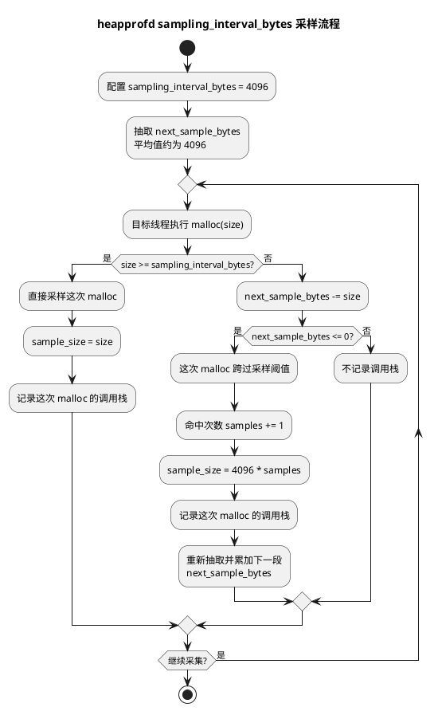
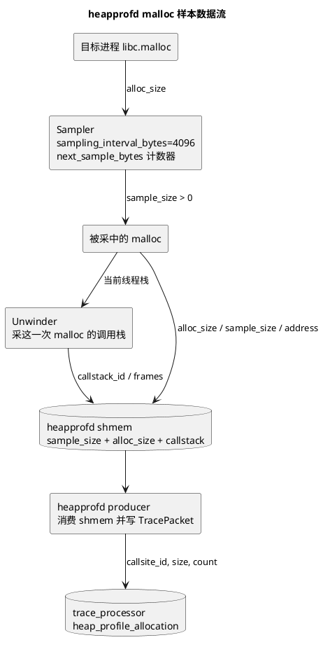

# mmap 真实物理内存归因 README

本工具用于回答一个问题：

```text
哪个 mmap 调用栈，最终占用了多少真实物理内存？
```

它不是只统计 mmap 的虚拟地址大小，而是把 Perfetto 中采到的 mmap 调用栈、mmap/munmap/mremap 生命周期，以及 `/proc/<pid>/smaps` 中的 PSS/RSS 快照做地址重叠归因，最终输出 Perfetto UI 和 Speedscope 可加载的 JSON。

默认入口同时采集 `mmap` 调用栈和 `libc.malloc` Native heap profile。本文把两个用途明确分开：

```text
主功能
  -> 采 mmap 调用栈，输出 mmap 物理内存归因 JSON 和 Speedscope 火焰图。

验证模式
  -> 不采 mmap 调用栈，只做无栈 mmap 事件健康检查。
```

无栈验证是测试功能，用来检查 mmap syscall 事件、smaps 和 meminfo 快照是否能被稳定采集，不能替代调用栈归因结果。无栈验证不启用 heapprofd malloc，也不做 malloc live 与 Native Heap Alloc 对比。

## 核心思路

```text
Perfetto raw_syscalls/sys_enter + sys_exit
  -> 还原 mmap / munmap / mremap 生命周期

Perfetto linux.process_stats + sched_switch
  -> 补齐 pid / thread 归属，避免无栈验证按目标进程过滤时误判为空

Perfetto linux.perf
  -> 在 mmap syscall enter 附近采样调用栈

Perfetto android.heapprofd
  -> 采集 libc.malloc Native heap profile，用于内存分配调用栈分析和 native heap 口径校验

/proc/<pid>/smaps
  -> 提供每个 VMA 当前真实物理占用：PSS / RSS / PrivateDirty

离线分析器
  -> 用 live mmap range 与 smaps VMA 做地址重叠
  -> 按调用栈聚合 PSS / RSS / virtual bytes
  -> 同一个 VMA 的 PSS/RSS 只归因一次；多个 mmap 命中同一 VMA 时按重叠权重分摊
```

优先看 `pss_bytes`。`rss_bytes` 对共享页会重复计数，适合作为辅助参考。

## 文件说明

```text
run_mmap_phys_profile.sh
  -> 默认入口脚本，使用写死默认配置启动采集和分析。

collect_mmap_phys_data.py
  -> 采集脚本：启动 Perfetto，周期拉 smaps，调用离线分析器，并生成内存总量验证报告。

mmap_phys_analyzer.py
  -> 离线分析器：读取 trace + smaps，输出归因 JSON。

test_mmap_phys_analyzer.py
  -> 单元测试，覆盖 mmap / munmap / smaps 归因、raw syscall 参数兼容、输出格式。
```

## 主功能：mmap 调用栈归因

主功能用于回答“哪个 mmap 调用栈最终占用了多少真实物理内存”。这是 `run_mmap_phys_profile.sh` 的默认行为，不需要额外参数：

```bash
./run_mmap_phys_profile.sh
```

默认目标进程：

```text
com.tencent.dhwdxkty.trunk.profiler
```

默认 trace processor：

```text
$PerfettoRoot/out/linux_clang_release/trace_processor_shell
```

运行前需要目标 App 已启动；脚本会等待目标进程出现。采集过程中可以触发 App 行为，例如：

```text
在手机上手动进入目标场景并执行需要观测的操作。
```

主功能采集和分析内容：

```text
linux.ftrace raw_syscalls
  -> 采 mmap / munmap / mremap 参数和返回值，用于还原 mmap 生命周期。

linux.perf callstack_sampling
  -> 在 mmap syscall enter 附近采目标进程调用栈。

android.heapprofd libc.malloc
  -> 采 libc.malloc Native heap profile；默认开启，用于内存分配分析和附带的总量验证。

/proc/<pid>/smaps
  -> 周期拉取 PSS / RSS / PrivateDirty 快照。

mmap_phys_analyzer.py
  -> 把 mmap live range 与 smaps VMA 做地址重叠，按 mmap 调用栈聚合 PSS / RSS / virtual bytes。
```

主功能输出：

```text
mmap_phys_attribution.json
  -> Perfetto UI 可加载的 mmap 调用栈物理内存归因结果。

mmap_phys_attribution.speedscope.json
  -> Speedscope 可加载的 mmap PSS 火焰图。

memory_validation.json
  -> 随采集生成的验证报告；只作为量级校验，不是主功能结果。
```

主功能必须优先看 `mmap_phys_attribution.json` 和 Speedscope 火焰图。`memory_validation.json` 不能替代调用栈归因。

## 验证模式：无栈 mmap 事件健康校验

验证模式用于测试或改代码后的量级校验。它故意关闭 mmap 调用栈采样，但会保留 `raw_syscalls/sys_enter`、`raw_syscalls/sys_exit` 和线程归属所需事件作为兼容兜底；部分设备的 `syscall_events` 过滤不会产出事件，只依赖它会让 mmap 侧验证结果恒为 0。

```bash
./run_mmap_phys_profile.sh --no-mmap-callstacks
```

该模式不采 `android.heapprofd`，也不传 `--malloc`、`--malloc-sampling-interval-bytes`、`--malloc-shmem-size-bytes` 或 heapprofd 自动调参参数。malloc 总量验证已经从无栈验证中删除；需要验证 Perfetto malloc 统计能力时，使用独立 heapprofd malloc APK demo。
运行无栈验证时脚本会先 `am force-stop` 目标 App，再启动 Perfetto，最后拉起目标 App，确保启动期 mmap syscall 不会在 Perfetto 就绪前漏掉。

验证模式采集和汇总内容：

```text
sys_mmap / sys_munmap / sys_mremap
  -> 不读取 mmap 调用栈，只还原无栈 mmap 生命周期。

最后一个 smaps 快照
  -> 与无栈 mmap live range 做地址重叠，汇总 mmap PSS / RSS / virtual bytes。

dumpsys meminfo
  -> 解析 Native Heap PSS / Native Heap Alloc / TOTAL PSS；报告保留 meminfo 作为快照参考，但不再做 malloc 对比。
```

验证模式输出：

```text
PerfData/mmap_phys/<时间戳>/
  -> 单轮无栈验证目录；通过或失败都会保留原始输入和报告。

memory_validation.json
  -> mmap 事件健康状态、mmap PSS 汇总和 meminfo 快照参考。

dumpsys_meminfo.txt
  -> adb shell dumpsys meminfo <package> 原始输出。

mmap_trace.perfetto-trace 和 smaps/
  -> 验证报告的原始输入。
```

验证模式不会生成新的 `mmap_phys_attribution.json` 和 `mmap_phys_attribution.speedscope.json`，因为当前运行没有采集 mmap 调用栈。它适合回答“无栈 mmap 事件是否能采到、smaps 是否能汇总”，不适合回答“哪个调用栈占了物理内存”，也不再回答“malloc live 是否接近 Native Heap Alloc”。

## 常用参数

```bash
./run_mmap_phys_profile.sh \
  --duration-ms 30000 \
  --smaps-interval-ms 1000
```

参数含义：

```text
--duration-ms
  -> Perfetto 采集时长，单位 ms。
  -> 默认 75000 ms，也就是 1 分 15 秒。

--smaps-interval-ms
  -> smaps 快照间隔，单位 ms。

--use-su
  -> 强制用 su 0 读取 /proc/<pid>/smaps。

--no-analyze
  -> 只采集 trace 和 smaps，不运行离线分析器。

--mmap-callstacks
  -> 采集 mmap 调用栈并运行 mmap 物理归因分析；这是默认主功能入口。

--no-mmap-callstacks
  -> 进入验证模式：不采 mmap 调用栈，只运行 mmap 事件健康检查。

--malloc / --no-malloc
  -> 主功能是否采集 libc.malloc Native heap profile；默认开启。
  -> 无栈验证模式会忽略 malloc 采集，不启用 heapprofd。

--malloc-sampling-interval-bytes
  -> heapprofd libc.malloc 采样间隔，默认 4096 bytes。
  -> 含义不是“只记录大于 4096 bytes 的分配”，也不是“每条调用栈精确代表 4096 bytes”；
     它是统计抽样的平均间隔。
  -> heapprofd 会为下一次样本抽一个随机剩余距离 next_sample_bytes。
     每次 malloc 发生时，用分配大小扣减这个距离；扣到 0 以下时，这次 malloc 被采样。
  -> 被采样的调用栈来自“触发过阈值的这一次 malloc”，记账量通常按
     sampling_interval_bytes * 命中次数估算；如果单次分配大于等于采样间隔，
     实现会直接按该 allocation 的实际大小记账。
  -> 数值越小，样本越密，malloc live/allocated/freed 的估算越细，但写入共享内存和 unwind 压力越大。
  -> 数值越大，样本越稀，开销和 heapprofd 截断风险更低，但小分配热点的精度会下降。

--malloc-shmem-size-bytes
  -> heapprofd 共享内存大小，默认 33554432 bytes。
  -> 目标进程先把 heapprofd 样本写入这块共享内存；如果写入速度超过 heapprofd 消费速度，
     trace_processor 的 stats 会出现 heapprofd_buffer_overran，说明 malloc profile 已截断。

--no-ftrace
  -> 不采 raw syscall 参数；只能调试 perf 调用栈，不适合最终归因。
```

说明：默认情况下，如果普通权限读取 smaps 得到 `Permission denied` 这类无效内容，采集脚本会自动尝试 `su 0`。

### heapprofd malloc 采样机制

`sampling_interval_bytes: 4096` 是“平均每 4096 bytes 分配量采一个样本”的统计参数。真实实现不是固定每累计 4096 bytes 必采一次，而是用指数分布抽出下一次样本到来的字节距离，这样可以避免固定周期刚好错过有规律的分配模式。

流程图：



数据流图：



调用栈和 4096 的关系：

```text
采样间隔 4096
  -> 是统计权重/平均间隔，不是某条调用栈真实分配量。

被采样调用栈
  -> 属于“跨过采样阈值的那一次 malloc”。

heap_profile_allocation.size
  -> trace_processor 里最终可查询的估算字节数。
  -> 对小分配样本，通常按 4096 * 命中次数记账。
  -> 对单次 size >= 4096 的大分配，heapprofd 实现会按实际 alloc_size 记账。
```

例子：

```text
sampling_interval_bytes = 4096
下一次样本距离假设抽到 3500

malloc A: size=1000, stack=A
  next_sample_bytes = 2500
  不采样，A 这次没有调用栈记录。

malloc B: size=2000, stack=B
  next_sample_bytes = 500
  不采样，B 这次没有调用栈记录。

malloc C: size=800, stack=C
  next_sample_bytes = -300
  C 跨过阈值，被采样。
  记录 stack=C。
  小分配估算 sample_size 约为 4096。
```

这个例子里，`stack=C` 不是说 C 真实分配了 4096 bytes；C 真实只分配了 800 bytes。它表示在统计抽样里，C 这次 malloc 被选中代表这一段分配流。很多样本聚合以后，按调用栈汇总的 `heap_profile_allocation.size` 才是可用于量级判断的估算内存量。

## Perfetto 采集配置

采集脚本会生成 `mmap_phys_config.pbtxt`。主功能核心配置如下：

```protobuf
data_sources {
  config {
    name: "linux.ftrace"
    ftrace_config {
      syscall_events: "sys_mmap"
      syscall_events: "sys_munmap"
      syscall_events: "sys_mremap"
      syscall_events: "sys_madvise"
      ftrace_events: "raw_syscalls/sys_enter"
      ftrace_events: "raw_syscalls/sys_exit"
      ftrace_events: "sched/sched_switch"
    }
  }
}

data_sources {
  config {
    name: "linux.process_stats"
    process_stats_config {
      scan_all_processes_on_start: true
    }
  }
}

data_sources {
  config {
    name: "android.heapprofd"
    heapprofd_config {
      shmem_size_bytes: 33554432
      sampling_interval_bytes: 4096
      process_cmdline: "com.tencent.dhwdxkty.trunk.profiler"
      heaps: "libc.malloc"
    }
  }
}

data_sources {
  config {
    name: "linux.perf"
    perf_event_config {
      timebase {
        period: 1
        tracepoint {
          name: "raw_syscalls:sys_enter"
          filter: "id == 222"
        }
      }
      callstack_sampling {
        scope {
          target_cmdline: "com.tencent.dhwdxkty.trunk.profiler"
        }
        kernel_frames: true
      }
    }
  }
}
```

### `raw_syscalls` 与 `syscall_events` 的区别

两者都属于 syscall 相关采集，但层级和数据量不同：

```text
ftrace_events: "raw_syscalls/sys_enter"
ftrace_events: "raw_syscalls/sys_exit"
  -> 直接打开内核 raw syscall tracepoint。
  -> 事件形态通用，常见字段是 syscall id、args、ret。
  -> 不写过滤条件时会采全系统所有 syscall enter/exit，数据量很大。
  -> 适合做底层兼容、排查参数展开问题，或给 linux.perf tracepoint 采样对齐。

syscall_events: "sys_mmap"
syscall_events: "sys_munmap"
syscall_events: "sys_mremap"
  -> Perfetto FtraceConfig 的 syscall 子集配置。
  -> 按 syscall 名称声明只关心哪些 syscall，Perfetto 负责映射到底层事件。
  -> 只保留目标 syscall 的 enter/exit 信息，数据量远小于全系统 raw_syscalls。
  -> 适合验证模式这类只需要 mmap 生命周期、不需要 mmap 调用栈的场景。
```

注意不要混淆两处 `raw_syscalls`：

```text
linux.ftrace / ftrace_events / raw_syscalls/sys_enter
  -> 把 raw syscall 事件写进 trace，未过滤时会放大全系统 trace。

linux.perf / tracepoint / raw_syscalls:sys_enter / filter: "id == 222"
  -> 只把 raw syscall tracepoint 当作 perf 采样触发器，用来在 mmap enter 附近采调用栈。
  -> 这里有 id 过滤，不等同于采全系统 raw syscall 事件表。
```

因此：

```text
主功能
  -> 保留 syscall_events、raw_syscalls 和 linux.perf。
  -> 目标是 mmap 生命周期 + mmap 调用栈归因，优先保证参数、返回值和采样对齐信息完整。

验证模式
  -> 保留 syscall_events、raw_syscalls enter/exit、sched_switch 和 linux.process_stats，不采 linux.perf。
  -> 目标是无栈 mmap 事件健康检查，优先避免 mmap 事件缺失。
```

验证模式保留 `linux.ftrace` 和 `linux.process_stats`，不会生成 `android.heapprofd` 或 `linux.perf` 的 `callstack_sampling` 配置；因此验证模式不会采 mmap 调用栈、不会展开 malloc 调用栈，也不会运行 mmap 调用栈归因分析。

arm64 syscall id：

```text
mmap   -> 222
munmap -> 215
mremap -> 216
```

## 输出目录

默认输出目录：

```text
PerfData/mmap_phys/<时间戳>/
```

主功能一次成功运行会生成：

```text
mmap_phys_config.pbtxt
  -> 本次 Perfetto 采集配置。

mmap_trace.perfetto-trace
  -> 原始 Perfetto trace。

smaps/
  -> 多份 /proc/<pid>/smaps 快照。

mmap_phys_attribution.json
  -> 主功能输出：Perfetto UI 可加载的 Chrome JSON trace。

mmap_phys_attribution.speedscope.json
  -> 主功能输出：Speedscope 可加载的火焰图 JSON。

dumpsys_meminfo.txt
  -> `adb shell dumpsys meminfo <package>` 原始输出。
  -> 在 Perfetto 采样结束并拉回 trace 后立即保存，早于 trace 健康检查和离线分析。

memory_validation.json
  -> 随主功能一起生成的 mmap 事件健康报告和 meminfo 快照参考。
```

验证模式一次成功运行会生成：

```text
mmap_phys_config.pbtxt
  -> 本次 Perfetto 采集配置；不包含 linux.perf callstack_sampling。

mmap_trace.perfetto-trace
  -> 原始 Perfetto trace。

smaps/
  -> 多份 /proc/<pid>/smaps 快照。

dumpsys_meminfo.txt
  -> `adb shell dumpsys meminfo <package>` 原始输出。
  -> 在 Perfetto 采样结束并拉回 trace 后立即保存，避免分析耗时影响 meminfo 快照时点。

memory_validation.json
  -> 验证模式主输出：mmap 事件健康报告和 meminfo 快照参考。
```

实际验证过的输出示例：

```text
/home/dianhun/disk2/work/fsprofiler/PerfData/mmap_phys/2026-06-02_12-51-13/
  mmap_phys_config.pbtxt
  mmap_trace.perfetto-trace
  smaps/
  mmap_phys_attribution.json
  mmap_phys_attribution.speedscope.json
  dumpsys_meminfo.txt
  memory_validation.json
```

## 结果怎么看

### Perfetto JSON

打开：

```text
PerfData/mmap_phys/<时间戳>/mmap_phys_attribution.json
```

可用 Perfetto UI 加载。重点看：

```text
traceEvents
  -> 时间线 counter。

metadata.final_summary
  -> 最后一个 smaps 快照时刻的最终归因结果。
```

`metadata.final_summary` 中每一项代表一条 mmap 调用栈：

```json
{
  "pss_bytes": 4096,
  "rss_bytes": 8192,
  "virtual_bytes": 8192,
  "private_dirty_bytes": 4096,
  "range_count": 1,
  "paths": ["/dev/ashmem/MemoryHeapBase (deleted)"],
  "stack": [
    "syscall_trace_enter [kernel]",
    "el0_svc_common [kernel]",
    "mmap [libc.so]",
    "_ZN7android14MemoryHeapBase5mapfdEibml [libbinder.so]"
  ],
  "stack_text": "..."
}
```

字段说明：

```text
pss_bytes
  -> 推荐使用的真实物理内存归因大小。

rss_bytes
  -> RSS 归因大小，共享页可能重复计数。

virtual_bytes
  -> 当前 live mmap range 与 smaps VMA 的虚拟地址重叠大小。

private_dirty_bytes
  -> smaps Private_Dirty 归因大小。

range_count
  -> 这条调用栈当前匹配到的 live range / VMA 重叠次数。

paths
  -> smaps VMA pathname，例如 /dev/mali0、ashmem、anon 区域。

stack
  -> 完整 mmap 调用栈。
```

### Speedscope 火焰图

打开：

```text
PerfData/mmap_phys/<时间戳>/mmap_phys_attribution.speedscope.json
```

加载到：

```text
https://www.speedscope.app/
```

火焰图权重单位是 bytes，当前按 `pss_bytes` 输出。也就是说，PSS 为 0 的 mmap 调用栈不会出现在 Speedscope 权重中，但仍会保留在 Perfetto JSON 的 `metadata.final_summary` 里。

校验口径：

```text
Speedscope total_weight
  <= metadata.final_summary 中的 PSS 汇总
  <= Perfetto JSON 里的 total mmap PSS/RSS counter
  <= 同一 smaps 快照的原始总 PSS
```

如果 Speedscope 总权重大于目标进程 smaps 原始 PSS，说明归因重复计数，不能把该火焰图当作物理内存结果。

### 验证报告 memory_validation.json

打开：

```text
PerfData/mmap_phys/<时间戳>/memory_validation.json
```

验证报告属于“验证模式”口径，用于回答：

```text
无栈 mmap syscall 事件是否可采；
smaps 是否能与无栈 mmap 生命周期汇总出最终 PSS；
dumpsys meminfo 是否已在采样结束后保存为同一轮验证的参考快照。
```

验证流程：

```text
sys_mmap / sys_munmap / sys_mremap
  -> 不读取 mmap 调用栈
  -> 与最后一个 smaps 快照做地址重叠，汇总 mmap PSS/RSS/virtual bytes

dumpsys meminfo
  -> 解析 Native Heap PSS / Native Heap Alloc / TOTAL PSS
  -> 采样结束后立即获取，后续 trace 健康检查和离线分析只复用这个文件
```

关键字段：

```text
mmap.pss_bytes
  -> 无栈 mmap 生命周期与 smaps 交叉后的 PSS 汇总。

meminfo.native_heap_alloc_bytes
  -> dumpsys meminfo Native Heap 的 Heap Alloc；无栈验证只记录该快照字段，不与 malloc live 对比。

trace_health.heapprofd_data_loss
  -> 来自 trace_processor stats 中的 heapprofd_buffer_overran /
     heapprofd_missing_packet / heapprofd_non_finalized_profile 汇总。
  -> 无栈验证不启用 heapprofd，正常不会出现该问题；如果主功能启用 heapprofd 时大于 0，
     表示 malloc profile 数据不完整，脚本会在终端输出 WARN。

trace_health.heapprofd_errors
  -> 来自 trace_processor stats 中的 heapprofd_client_error 汇总。
  -> 无栈验证不启用 heapprofd，正常不会出现该问题；主功能启用 heapprofd 时大于 0
     会在 validation.issues 中写入 heapprofd_errors。
```

注意：验证报告是测试口径，主要看 mmap 事件健康和 smaps 汇总是否可用。它不提供调用栈归因，也不替代 `mmap_phys_attribution.json` 和 Speedscope 火焰图。

## 独立 heapprofd malloc APK demo

malloc 总量验证已从无栈验证中删除。需要隔离验证 Perfetto/heapprofd 的
malloc 数据统计功能是否正常时，应运行独立 APK demo。

```bash
TOTAL_BYTES=1073741824 \
START_DELAY_SECONDS=10 \
ALLOC_SECONDS=60 \
HOLD_SECONDS=20 \
MALLOC_SHMEM_SIZE_BYTES=268435456 \
./run_heapprofd_malloc_apk_demo.sh
```

demo 只验证 malloc 分配量，不叠加超深调用栈，避免调用栈展开成本干扰分配量口径。
默认场景会在 1 分钟内累计 malloc 1 GiB，每次分配大小按 1 byte 到 1 MiB 的范围变化，
每块内存都会写入以确保 Native Heap PSS 能反映真实驻留。

demo 报告路径：

```text
PerfData/heapprofd_malloc_apk_demo/<时间戳>/malloc_demo_report.json
```

关键字段：

```text
demo.expected_live_bytes
  -> demo 持有的 malloc 分配总量。

demo.mallinfo_uordblks
  -> App 进程内 mallinfo() 看到的 Native Heap 已分配量。

heapprofd.cumulative.live_bytes
  -> heap_profile_allocation 全窗口累计净 live bytes；这是 continuous dump 下用于
     对比分配量的主口径。

heapprofd.latest_dump.live_bytes
  -> max(ts) 分片口径，仅用于暴露 continuous dump 的口径差异，不作为分配量主判断。

meminfo.native_heap_alloc_bytes
  -> dumpsys meminfo Native Heap 的 Heap Alloc。

meminfo.native_heap_pss_plus_swap_pss_bytes
  -> Native Heap PSS + SwapPss；设备发生换出时，单看 PSS 可能低于 Heap Alloc。
```

## 离线单独分析

如果已经有 trace 和 smaps，可以直接运行：

```bash
python3 -u -B mmap_phys_analyzer.py \
  --trace PerfData/mmap_phys/<时间戳>/mmap_trace.perfetto-trace \
  --smaps-dir PerfData/mmap_phys/<时间戳>/smaps \
  --pid <目标 pid> \
  --output PerfData/mmap_phys/<时间戳>/mmap_phys_attribution.json \
  --speedscope-output PerfData/mmap_phys/<时间戳>/mmap_phys_attribution.speedscope.json \
  --trace-processor $PerfettoRoot/out/linux_clang_release/trace_processor_shell
```

## 单元测试

运行：

```bash
python3 -B -m unittest -v test_mmap_phys_analyzer.py
```

覆盖内容：

```text
1. trace_processor stderr 日志不会污染 CSV。
2. raw_syscalls repeated args 会按顺序展开成 arg0 / arg1。
3. 默认主功能和验证模式都包含 raw_syscalls/sys_enter、raw_syscalls/sys_exit、sched_switch 和 linux.process_stats；验证模式不采 linux.perf 调用栈和 android.heapprofd。
4. smaps 普通读取无效时会自动尝试 su 0。
5. mmap + perf sample + munmap 会正确归因到 smaps PSS。
6. raw syscall 缺少 mmap length 时，用返回地址所在 VMA 归因。
7. partial munmap 会切分 live range。
8. 默认主功能会采 mmap 调用栈和 libc.malloc Native heap profile。
9. 显式验证模式不会采 mmap 调用栈，也不会启用 heapprofd malloc。
10. mmap 验证 SQL 不读取调用栈表，也不读取 heap_profile_allocation。
11. memory_validation.json 会输出 mmap 事件健康状态，不输出 malloc/native heap 口径校验。
12. 默认采集时长是 75000 ms，且 dumpsys meminfo 早于 trace 健康检查和离线分析保存。
```

保留单元测试落盘输出：

```bash
MMAP_PHYS_TEST_OUTPUT=/home/dianhun/disk2/work/fsprofiler/PerfData/mmap_phys_attribution_test.json \
MMAP_PHYS_TEST_SPEEDSCOPE_OUTPUT=/home/dianhun/disk2/work/fsprofiler/PerfData/mmap_phys_attribution_test.speedscope.json \
  python3 -B -m unittest -v test_mmap_phys_analyzer.py
```

## 已验证结果

主功能端到端验证命令：

```bash
./run_mmap_phys_profile.sh
```

采集期间在手机上手动触发目标场景，不使用随机 monkey 事件生成测试数据。

主功能验证输出：

```text
perf samples: 19
stacks: 581
syscall events: 99220
lifecycle events: 19
smaps snapshots: 21
写入: PerfData/mmap_phys/2026-06-02_12-51-13/mmap_phys_attribution.json
写入火焰图: PerfData/mmap_phys/2026-06-02_12-51-13/mmap_phys_attribution.speedscope.json
dumpsys meminfo 已保存: PerfData/mmap_phys/2026-06-02_12-51-13/dumpsys_meminfo.txt
验证报告已保存: PerfData/mmap_phys/2026-06-02_12-51-13/memory_validation.json
```

结果检查：

```text
metadata.final_summary 条目数: 8
Speedscope frames: 30
Speedscope samples: 1
Speedscope total_weight: 4096 bytes
```

示例非零归因：

```text
pss_bytes: 4096
rss_bytes: 8192
virtual_bytes: 8192
paths: /dev/ashmem/MemoryHeapBase (deleted)
stack: mmap [libc.so] -> android::MemoryHeapBase::mapfd [libbinder.so]
```

## 已知边界

```text
1. 归因基于 smaps 快照时刻的当前物理占用，不是 mmap 发生瞬间的物理占用。
2. mmap 虚拟大小不等于真实物理占用，最终以 PSS/RSS 为准。
3. 当前 Speedscope 火焰图按 PSS 输出，PSS 为 0 的栈不会显示在火焰图中。
4. 部分设备 raw_syscalls 只暴露 mmap 返回地址，不暴露 length；分析器会用返回地址所在 VMA 做归因。
5. 只有采到 perf 调用栈的 mmap 会进入最终归因，避免全局 syscall 噪声。
6. 如果采集窗口内没有新的 mmap 调用栈，结果可能为空；需要触发目标 App 行为。
7. perf lost records 会影响调用栈完整性，可通过降低事件量、缩短采集窗口或调整 perf buffer 继续优化。
8. 多个 mmap 调用栈命中同一个 VMA 时，VMA 的 PSS/RSS 会按命中权重分摊，避免同一份物理页重复计入多个栈。
9. `memory_validation.json` 是测试验证口径；它故意不读取 mmap 调用栈，也不启用 heapprofd malloc，只用于检查 mmap 事件健康、smaps 汇总和 meminfo 快照参考。
```
